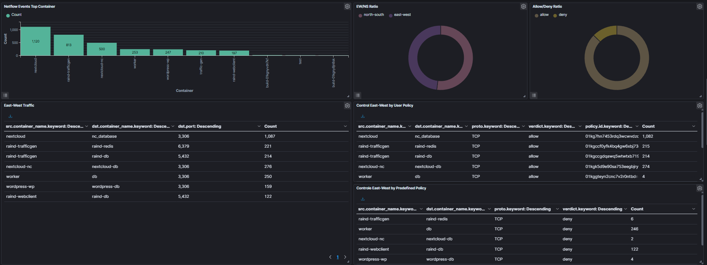
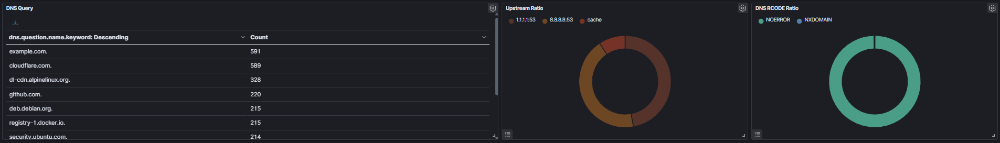
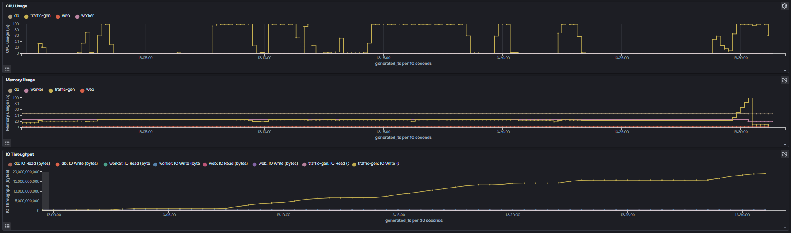
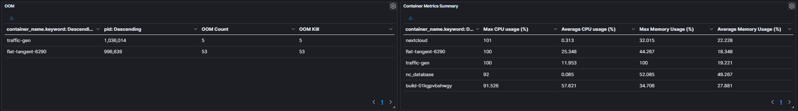

# Raind - Zero Trust Oriented Container Runtime

<p>
  
</p>

 

Raindは、**Zero Trustをコンテナランタイムのレイヤで実装できるか**を検証するPoC（概念実証）として作られたコンテナランタイムです。  
本リポジトリは、Raindを構成する3コンポーネントを`components/`配下にsubmoduleとして配置したメタリポジトリです。

**構成要素**
- `Raind-CLI`: 利用者向けCLI（UI層）
- `Condenser`: 高レベルコンテナランタイム（制御面）
- `Droplet`: 低レベルコンテナランタイム（実行面 / OCI準拠）

詳細な設計や責務分離については[Design Document](docs/design.md)を参照してください。

## 主要な特徴
- Zero Trust指向コンテナ制御
- East-West通信はデフォルトDenyのポリシー設計
- North-South通信は`observe`/`enforce`モード切替
- iptables管理チェーンのフル再構築による冪等なポリシー反映
- NFLOG + ulogd2 + CondenserによるログEnrichment
- CLIからのコンテナ操作とポリシー管理
- Condenserによるコンテナ・イメージ管理
- DropletによるOCI準拠のコンテナ実行

### Zero Trust指向コンテナ制御
Raindでは、East-West通信(コンテナ間通信)はデフォルトで拒否します。  
コンテナ起動時に **明示的に** ポリシーによって許可することでのみ通信可能とし、コンテナ侵害時の横移動や偵察行為等をブロックするとともに、後述のログEnrichmentと併せることで、不審な挙動を行っているコンテナの検知を可能とします。  
Bottle(≒docker-compose)作成時には明示的にポリシーを定義することも可能です。

```yaml
# bottle.yaml
bottle:
  name: wordpress
services:
  wp:
    image: wordpress
    env:
      - WORDPRESS_DB_HOST=db:3306
      - WORDPRESS_DB_USER=wordpress
      - WORDPRESS_DB_PASSWORD=wordpress
      - WORDPRESS_DB_NAME=wordpress
    ports:
      - "8080:80"
    depends_on:
      - db
  db:
    image: mysql
    env:
      - MYSQL_ROOT_PASSWORD=wordpress
      - MYSQL_DATABASE=wordpress
      - MYSQL_USER=wordpress
      - MYSQL_PASSWORD=wordpress
# allowed traffic
policies:
  - type: east-west
    source: wp
    destination: db
    protocol: tcp
    dest_port: 3306
    comment: "wp->db 3306/tcp: Allow Database Traffic"
```

### NFLOG + ulogd2 + CondenserによるログEnrichment
Raindでは、コンテナによる通信の可視化を標準機能として実装しています。

- Trafficログ
- DNSログ
- Metrics

また全てのログにおける送信元/宛先はコンテナ名とマッピングされ、より直感的に確認できます。

#### SIEM連携
[Wazuh](https://wazuh.com/)を利用し、これらのログを可視化した場合のイメージです。  

- Trafficログ



- DNSログ


- Metrics



SIEM連携により、トラフィック急増/リソース占有/OOMといったコンテナの異常動作を検知することが可能となります。

## アーキテクチャ概要
- `Raind-CLI`がREST/WebSocket経由で`Condenser`を操作
- `Condenser`がコンテナ状態・ネットワーク・ポリシーをSSOTとして管理
- `Droplet`がOCI設定に基づきNamespace/Cgroup/Capability等を構成して実行

設計図と詳細な責務は[Design Document](docs/design.md)にまとめています。

## 前提条件
- Linux（namespace/cgroup対応カーネル）
- Go 1.25以上
- `sudo`実行権限
- `iptables`利用環境
- `ulogd2`（NFLOG収集用）

Droplet単体での検証では、イメージ取得等にDockerが必要になる場合があります。  
ネットワークログの収集・Enrichmentは`ulogd2`が前提です。

## セットアップ（メタリポジトリ）
1. submoduleの初期化
```
git submodule update --init --recursive
```
2. 依存チェック
```
make bootstrap
```
3. ビルド
```
make build
```
4. インストール（任意）
```
sudo make install
```

上記のほか、パッケージインストールやulogd2の設定等も必要です。  
詳細は[Raind Install](docs/install.md)を参照してください。

## 実行例
Condenserを起動してからCLIを利用します。
```
sudo ./components/condenser/bin/condenser
sudo ./components/raind-cli/bin/raind container ls
```

systemdサービスとして起動する場合:
```
sudo make enable-service
```

## CLI利用方法
詳細なコマンドは[Command List](docs/command_list.md)を参照してください。  
例:
```
sudo raind container run -t alpine:latest
sudo raind policy ls
sudo raind logs netflow --json
```

## ドキュメント
- [Design Document](docs/design.md): Zero Trust設計・iptables設計・ログ設計
- [Command List](docs/command_list.md): CLIコマンド一覧
- [Bottle Usage](docs/bottle.md): Bottle(複数コンテナオーケストレーション)利用手順

## ステータス
RaindはPoCとして開発中です。  
APIや挙動は今後変更される可能性があります。
