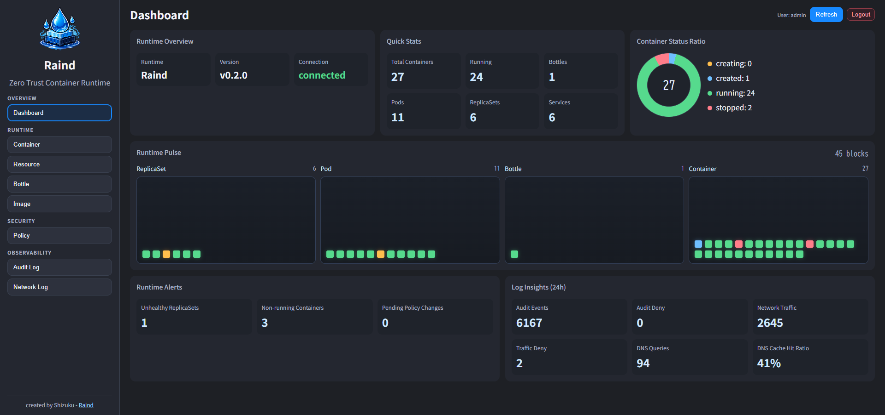
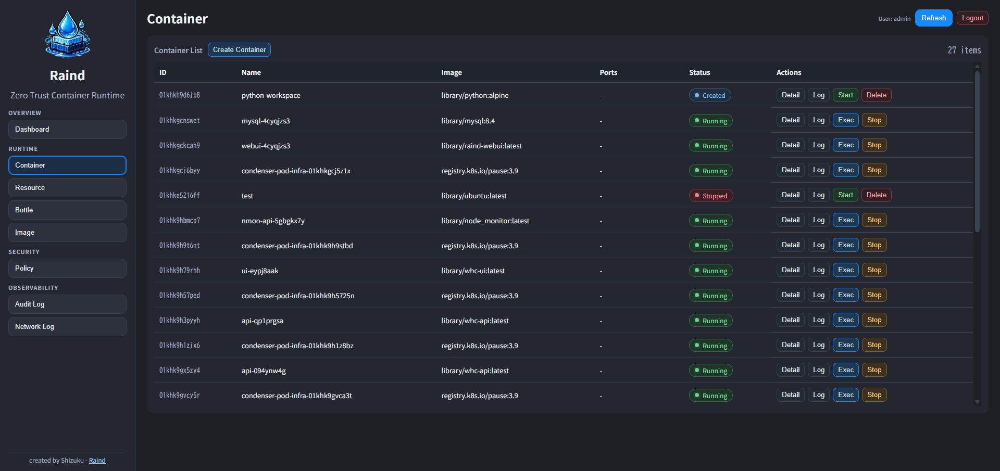
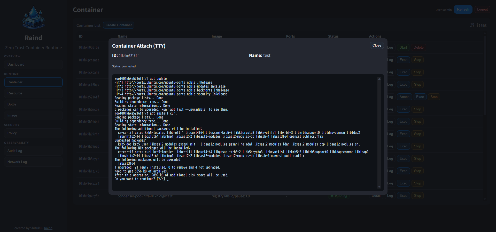
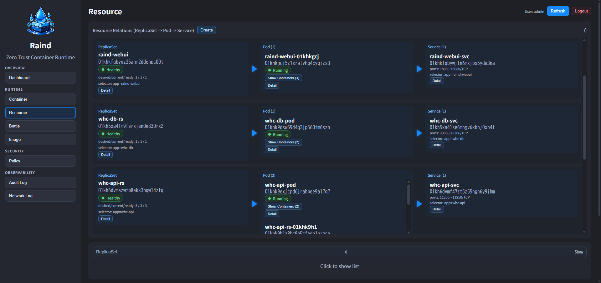
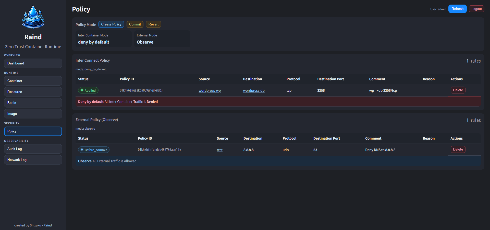
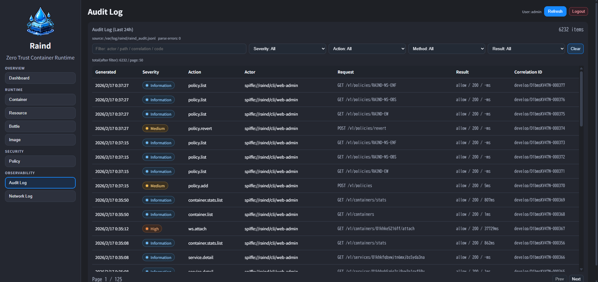
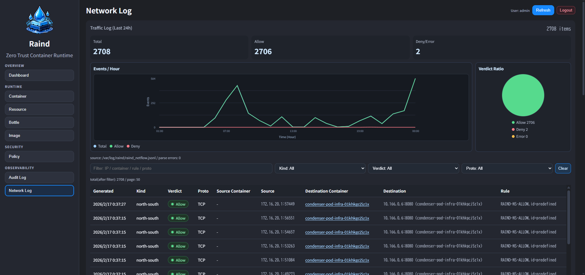

# Raind - Zero Trust Oriented Container Runtime
<p>
  
</p>

Zero Trust oriented container runtime for Linux.  
Raind focuses on controlling and visualizing container networking at the runtime layer, not only at orchestration or app layer.

## Concept

Raind provides:

- Runtime-level network policy enforcement (East-West / North-South)
- Runtime-level traffic visibility (traffic/DNS/audit logs)
- Unified operations for container lifecycle and grouped workloads
- Localhost-restricted control plane with UDS gateway pattern for WebUI

## What Is Included

Raind is organized as a monorepo:

- `cmd/raind`: user-facing CLI entrypoint
- `cmd/condenser`: high-level runtime daemon entrypoint (API, state, policy, resource orchestration)
- `cmd/droplet`: low-level OCI runtime executor entrypoint
- `cmd/raind-ui-gateway`: UDS gateway entrypoint to Condenser (mTLS upstream)
- `internal/`: component implementations grouped by `raind`, `condenser`, `droplet`, and `raind-ui-gateway`
- `webui/`: Vue + Vite based Web UI

## Core Features

- Container lifecycle: create/start/stop/delete, attach, exec, logs, stats
- Image management: pull/build/list/remove
- Orchestration:
  - Bottle (Compose-style grouped multi-container operation)
  - ReplicaSet / Pod / Service (desired-state management and selector-based service routing)
- Resource management: ReplicaSet / Pod / Service apply/delete/list/show
- Bottle management: grouped multi-container operation
- OCI-compliant low-level runtime security (Droplet):
  - Namespace and cgroup-based isolation/resource control
  - Capability set controls
  - Seccomp syscall filtering
  - AppArmor profile integration
  - OCI lifecycle hooks
- Policy management:
  - `RAIND-EW` (Inter Connect)
  - `RAIND-NS-OBS` (External Observe)
  - `RAIND-NS-ENF` (External Enforce)
  - commit/revert workflow
- Security-focused logging:
  - Audit log (`/var/log/raind/raind_audit.jsonl`)
  - Netflow log (`/var/log/raind/raind_netflow.jsonl`)
  - DNS log (`/var/log/raind/raind_dns.jsonl`)
- WebUI pages:
  - Dashboard, Container, Resource, Bottle, Image, Policy, Audit Log, Network Log
  - Filtering, pagination, relation views, overlays for actions/details/logs
  - Terminal attach/exec UX via WebSocket

## Quick Start

### 1. Build and Install

```bash
# need Workshop
# https://ubuntu.com/workshop/docs/

git clone https://github.com/shizuku198411/Raind.git
cd Raind
sudo ./scripts/build.sh
sudo usermod -aG raind "$USER"
```

Log out and back in, or run `newgrp raind`, before using `raind` as a non-root CLI.

### 2. Verify

```bash
raind container run -p 9988:80 nginx:latest
raind container ls
```

### 3. Test

```bash
workshop run raind-dev -- test-unit
workshop run raind-dev -- test-e2e
```

### 4. Workshop Manual Runtime

Use an isolated Workshop runtime when you want to manually try raind changes
without touching containers or services already running on your host.

```bash
workshop run raind-dev -- dev-install
workshop run raind-dev -- dev-start
workshop shell raind-dev
```

in workshop, you can try raind operations.
```bash
# 
```

Clean up the Workshop runtime after manual testing:

```bash
workshop run raind-dev -- dev-cleanup
```

### 5. Launch WebUI

Build/deploy `webui/` with its manifest:

```bash
cd webui
raind image build -f . -t raind-webui:latest
raind resource apply -f deploy/manifest.yaml
```

## WebUI Overview
### Dashboard


### Container Page




### Resource Relations


### Policy Page


### Audit / Network Log Pages




## Security Model (Summary)

- Condenser control API is localhost/mTLS oriented.
- WebUI does not directly call Condenser from containers.
- `raind-ui-gateway` exposes controlled UDS for WebUI backend.
- Policy is enforced at runtime networking path.
- Runtime-level logs provide traceability for actions and traffic.

## Documentation

- Install: [EN](docs/en/install.md) / [JP](docs/jp/install.md)
- WebUI: [EN](docs/en/webui.md) / [JP](docs/jp/webui.md)
- UDS Gateway: [EN](docs/en/webui_gateway.md) / [JP](docs/jp/webui_gateway.md)
- Command list: [EN](docs/en/command_list.md) / [JP](docs/jp/command_list.md)
