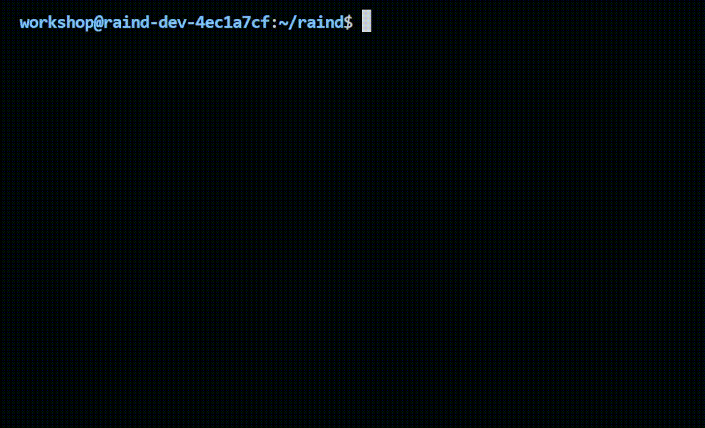

# Raind

<p align="center">
  
</p>

<p align="center">
  <strong>Validate how your application actually runs before turning it into Docker or Kubernetes deployment.</strong>
</p>

<p align="center">
  <a href="./LICENSE"></a>
  
  
  
  
  
</p>

> [!WARNING]
> Raind is experimental. It is not a Kubernetes distribution and does not aim to be fully Kubernetes-compatible. It focuses on a growing local subset that is useful for validating application deployment shape before a real cluster.

Raind is a local application validation workflow for the stage before Docker and Kubernetes deployment.
It runs your application as real containers, promotes the working runtime state into a Bottle(Compose-style), then promotes the running Bottle into Kubernetes-style resource drafts.

The main workflow is **Promote Strategy**: one `raind-strategy.yaml` describes the seed containers and the health checks for each stage.
Raind then runs the whole flow for you:

```text
container run
  → health check
  → generate Bottle draft
  → bottle up
  → health check
  → generate Kubernetes-style resource drafts
  → resource apply
  → health check
```



Generated files are drafts. They are meant to be reviewed before being used outside Raind.

## Why Raind?

Application deployment usually moves through several disconnected stages:

```text
container run
  → compose.yaml
  → kind / minikube / Kubernetes manifests
  → cluster validation
```

That workflow often turns into copy-and-edit drift. Ports, secrets, service names, volumes, and network rules are repeated across files, and generated manifests often do not know whether the application ever worked.

Raind takes a different path:

```text
actual run
  → observed runtime state
  → health-checked promotion
  → reviewable deployment drafts
```

Raind gives you one local runtime for:

- single-container application tests(Docker-style),
- multi-service Bottle stacks(Compose-style),
- Deployments, Services, Ingress, PVCs, Secrets, ConfigMaps, and NetworkPolicies(Kubernetes-style),
- runtime security policy and netflow logs,
- automated promotion from one stage to the next.

## Quickstart: Promote Strategy

Create `raind-strategy.yaml`.

```yaml
apiVersion: raind.io/v1alpha1
kind: PromoteStrategy

metadata:
  name: web-stack

source:
  mode: create
  containers:
    - name: mysql
      image: mysql:8
      env:
        MYSQL_ROOT_PASSWORD: root-password
        MYSQL_DATABASE: app
        MYSQL_USER: app
        MYSQL_PASSWORD: app-password
      ports:
        - "3306:3306"

    - name: nginx
      image: nginx:latest
      ports:
        - "9980:80"

stages:
  container:
    checks:
      runtime:
        - name: mysql-running
          type: containerStatus
          target: mysql
          expect:
            state: running

        - name: nginx-running
          type: containerStatus
          target: nginx
          expect:
            state: running

      application:
        - name: nginx-http
          type: http
          target: http://127.0.0.1:9980
          expect:
            status: 200
          timeout: 60s
          interval: 2s

    promote:
      to: bottle
      output: raind_promote/bottle/bottle.yaml

  bottle:
    checks:
      runtime:
        - name: bottle-running
          type: bottleStatus
          target: web-stack
          expect:
            state: running

      application:
        - name: nginx-http
          type: http
          target: http://127.0.0.1:9980
          expect:
            status: 200
          timeout: 60s
          interval: 2s

    promote:
      to: resources
      output: raind_promote/resources

  resources:
    apply:
      file: raind_promote/resources/all.yaml

    checks:
      application:
        - name: nginx-http
          type: http
          target: http://127.0.0.1:9980
          expect:
            status: 200
          timeout: 60s
          interval: 2s
```

Run the strategy.

```sh
raind promote strategy
```

Raind prints the current stage and task while it works.

```text
Promote Strategy: web-stack
[container] create::mysql ... ok
[container] create::nginx ... ok
[container] runtime ... ok
[container] checks::runtime::mysql-running ... ok
[container] checks::runtime::nginx-running ... ok
[container] checks::application::nginx-http ... ok
[container] promote ... raind_promote/bottle/bottle.yaml
[container] delete ... ok
[bottle] apply ... web-stack
[bottle] checks::runtime::bottle-running ... ok
[bottle] checks::application::nginx-http ... ok
[bottle] promote ... raind_promote/resources
[bottle] delete ... ok
[resources] apply ... raind_promote/resources/all.yaml
[resources] checks::application::nginx-http ... ok
[resources] delete ... ok
bottle draft: raind_promote/bottle/bottle.yaml
resource drafts: raind_promote/resources
```

Review the generated drafts.

```text
raind_promote/
  bottle/
    bottle.yaml
    REVIEW_BOTTLE.md
  resources/
    00-namespace.yaml
    01-configmap.yaml
    02-secret.example.yaml
    04-deployments.yaml
    05-services.yaml
    REVIEW.md
    all.yaml
```

`raind promote strategy` is intentionally runtime-aware. Each stage is created, checked, promoted, and then cleaned up before the next stage begins. This avoids port conflicts while still ensuring that the generated drafts came from something that actually ran.

For the complete Strategy schema, all check types, optional fields, and manual Promote commands, see [Promote workflow](./docs/guides/promote.md).

## What Promote Strategy validates

A strategy file defines two things:

1. **The seed runtime**: the containers Raind should create first.
2. **The checks for each stage**: runtime and application checks for containers, Bottle, and resources.

Supported check types include:

| Check type | Purpose |
|---|---|
| `containerStatus` | Confirm that a named container reached the expected state. |
| `bottleStatus` | Confirm that a Bottle is running and has runtime container state. |
| `http` | Confirm that an HTTP endpoint responds with the expected status/body. |
| `tcp` | Confirm that a host and port can accept TCP connections. |

The default output layout is stable and repo-friendly:

```text
raind_promote/bottle/bottle.yaml
raind_promote/bottle/REVIEW_BOTTLE.md
raind_promote/resources/all.yaml
raind_promote/resources/REVIEW.md
```

Strategy-generated drafts overwrite previous drafts by default because they are generated review artifacts.

## Design principles

### Runtime-aware, not static translation

Promote starts from things Raind has actually run or observed. Strategy promotes only after each stage passes its checks.

### Reviewable, not magical

Generated files are drafts. Raind writes review reports and TODOs where production decisions are still required.

### Preserve intent

Names, images, commands, ports, service boundaries, environment variables, volumes, and traffic relationships are kept whenever possible.

### Validate before deployment

Raind focuses on the local workflow before a real Docker Compose or Kubernetes deployment: run it, check it, generate a draft, and review the result.

## Core capabilities

### Promote Strategy

```sh
raind promote strategy
raind promote strategy -f raind-strategy.yaml
raind promote strategy --dry-run
raind promote strategy --until bottle
raind promote strategy --namespace web-stack --ingress-host web.raind.local
```

### Containers

```sh
raind container run --name web -p 8080:80 nginx:latest
raind container exec web /bin/sh
raind container logs web
raind container stop web
raind container rm web
```

### Bottles

```sh
raind bottle up
raind bottle show web-stack
raind bottle down
```

Default file discovery:

1. `bottle.yaml`
2. `compose.yaml`
3. explicit `-f <path>`

### Kubernetes-style resources

Raind supports a growing local subset including:

- Namespace
- Pod
- Deployment
- ReplicaSet
- Service
- Ingress
- ConfigMap
- Secret
- PersistentVolumeClaim
- NetworkPolicy

```sh
raind resource apply -f raind_promote/resources/all.yaml
raind resource get pod
raind resource get deploy
raind resource get service
raind resource delete -f raind_promote/resources/all.yaml
```

### Network visibility and policy

Raind connects NetworkPolicy-style manifests and Bottle policies to runtime-managed east-west security policy.

```sh
raind security policy ls --type ew
raind logs netflow
```

Example:

```text
POLICY TYPE : East-West
CURRENT MODE: deny_by_default

FLAG  SRC CONTAINER  DST CONTAINER  PROTOCOL  DST PORT  ACTION
[*]   wordpress      mysql          tcp       3306      ALLOW
  >> DENY ALL EAST-WEST TRAFFIC <<
```

## What Raind is not

Raind is not a replacement for Docker, Podman, kind, minikube, or Kubernetes.

| Tool | Primary role |
|---|---|
| Docker / Podman | General container engine |
| kind / minikube | Run a real Kubernetes cluster locally |
| Kubernetes | Production-grade orchestration platform |
| Raind | Runtime-promoted local deployment validation before Docker/Kubernetes deployment |

Raind is for the space where you want to know:

- Did the container actually run?
- Did the multi-service stack actually communicate?
- What should the next deployment draft look like?
- Can the Kubernetes-style shape be validated locally before a real cluster?

## Demo

Raind Promote Strategy is the main story, but the same runtime can also be used for normal development checks.
You can run containers, start Bottle stacks, and apply Kubernetes-style resources directly, then promote the working runtime state when the application shape is ready.


## Documentation

- [Documentation index](./docs/)
- [Promote Strategy and manual Promote workflow](./docs/guides/promote.md)
- [Bottles](./docs/guides/bottles.md)
- [Containers](./docs/guides/containers.md)
- [Architecture](./docs/architecture/)
- [Resource reference](./docs/resources/)
- [CLI reference](./docs/reference/cli.md)
- [Manifest schema](./docs/reference/manifest-schema.md)
- [Security](./SECURITY.md)
- [Contributing](./CONTRIBUTING.md)

## Project status

Raind is experimental and evolving quickly.

Current focus areas include:

- strengthening Promote Strategy,
- expanding the Kubernetes-style resource subset,
- improving validation and review reports,
- improving Service, DNS, and Ingress behavior,
- improving NetworkPolicy reconciliation and netflow visibility,
- hardening runtime state management and security-sensitive paths.

## Contributing

Contributions are welcome. See [CONTRIBUTING.md](./CONTRIBUTING.md), [CODE_OF_CONDUCT.md](./CODE_OF_CONDUCT.md), and [SECURITY.md](./SECURITY.md).
