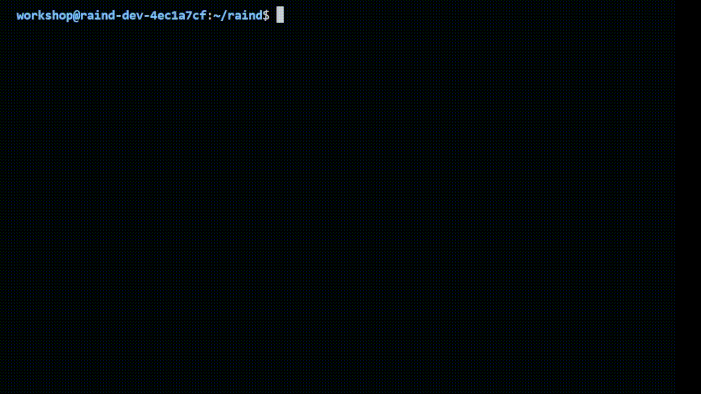
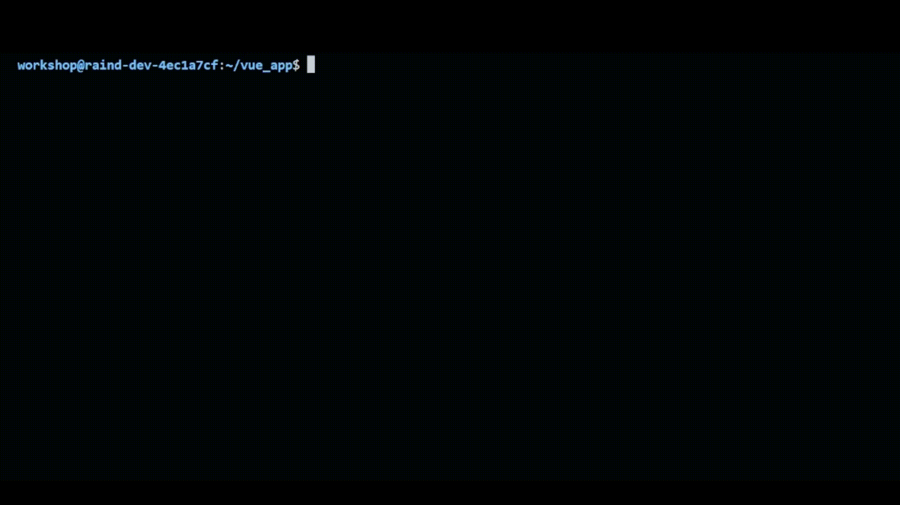
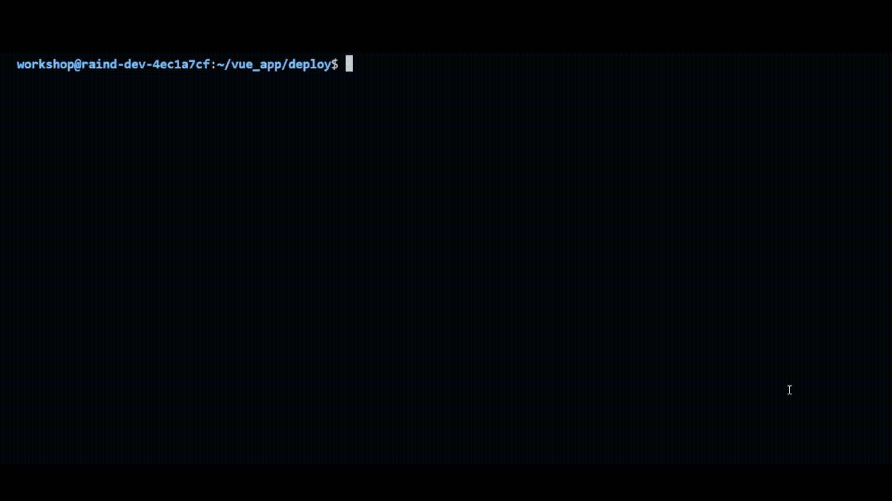

# Raind

<p align="center">
  
</p>

<p align="center">
  <strong>An application container validation runtime for pre-Kubernetes deployment workflows</strong>
</p>

<p align="center">
  <a href="./LICENSE"></a>
  
  
  
  
  
</p>

> [!WARNING]
> Raind is not intended for production use, nor is it designed to be a replacement for Docker or Kubernetes, or to provide full compatibility with either platform.

Raind is a runtime focused on local startup validation before deploying applications to production environments such as Docker or Kubernetes. It helps verify whether an application can run as a container or Pod, and supports tuning runtime parameters before deployment.

Raind provides an end-to-end startup validation flow from containers to Pods, and generates reviewable Docker/Kubernetes configuration drafts based on the runtime state.

1. Can the application start as a single container? (Docker-style application startup validation)
2. Can multiple containers start and communicate with each other? (Compose-style application integration validation)
3. Can the application start as a Pod? (Kubernetes-style application startup validation)

## Motivation

When deploying applications to Kubernetes, developers often validate single containers locally with Docker and then test Pods with Kubernetes. However, runtime behavior is not automatically guaranteed across different runtimes.  
In other words, even if an application works with Docker or Compose, manually creating Kubernetes manifests from that working state does not guarantee that the values match the Docker/Compose runtime state, or that the application will work correctly in a different structure such as a Pod.  
These gaps often surface during production deployment and require additional tuning.

Raind is being developed as a runtime that aims to provide **consistent validation from Containers (Docker-style) to Pods (Kubernetes-style)**.

## Promote Strategy

One of Raind's most important features is **Promote Strategy**.  
It defines a strategy for validating an application across the full promotion flow: from single-container startup validation (Docker-style), to multi-container collaboration (Compose-style), and finally to Pod-based startup validation (Kubernetes-style).

A strategy describes:

- what containers should be started
- what communication should be allowed between containers
- what criteria should be used to determine whether startup succeeded

Raind then runs the validation automatically according to that strategy.

```bash
raind promote strategy
```



<details><summary>Example strategy definition file</summary>

```yaml
apiVersion: raind.io/v1alpha1
kind: PromoteStrategy

metadata:
  name: wordpress-stack

source:
  mode: create
  containers:
    - name: mysql
      image: mysql:8
      env:
        MYSQL_ROOT_PASSWORD: root-password
        MYSQL_DATABASE: wordpress-db
        MYSQL_USER: wordpress-user
        MYSQL_PASSWORD: wordpress-password
      volume:
        - /mnt/mysql:/var/lib/mysql

    - name: wordpress
      image: wordpress:latest
      env:
        WORDPRESS_DB_HOST: mysql
        WORDPRESS_DB_NAME: wordpress-db
        WORDPRESS_DB_USER: wordpress-user
        WORDPRESS_DB_PASSWORD: wordpress-password
      ports:
        - "9850:80"

  policies:
    - type: ew
      source: wordpress
      destination: mysql
      protocol: tcp
      destPort: 3306
      comment: allow wordpress database access

stages:
  container:
    checks:
      runtime:
        - name: mysql-running
          type: containerStatus
          target: mysql
          expect:
            state: running
          timeout: 60s
          interval: 2s

        - name: wordpress-running
          type: containerStatus
          target: wordpress
          expect:
            state: running
          timeout: 60s
          interval: 2s

  bottle:
    checks:
      runtime:
        - name: bottle-running
          type: bottleStatus
          target: wordpress-stack
          timeout: 60s
          interval: 2s

      application:
        - name: wordpress-http
          type: http
          target: http://127.0.0.1:9850/wp-admin/login.php
          expect:
            status: 200
          timeout: 90s
          interval: 2s

  resources:
    checks:
      application:
        - name: wordpress-http
          type: http
          target: http://127.0.0.1:9850/wp-admin/login.php
          expect:
            status: 200
          timeout: 90s
          interval: 2s
```

</details>

### Generating reviewable configuration files

Promote Strategy is more than a runtime validation feature.  
When promoting from a single container to multiple containers (Docker-style → Compose-style), and from multiple containers to Pods (Compose-style → Kubernetes-style), Raind generates **reviewable configuration files based on the actual running runtime state**.

<details><summary>Example generated Compose file:</summary>

```yaml
# Generated by Raind Promote from container/mysql, container/wordpress.
# This compose.yaml is a reviewable draft, not production configuration.
# Review env, mounts, ports, and dependencies before sharing.

services:
  mysql:
    image: "mysql:8"
    command:
      - "docker-entrypoint.sh"
      - "mysqld"
    # TODO: secret candidate redacted from container env: MYSQL_PASSWORD
    # env example: MYSQL_PASSWORD=<redacted>
    # TODO: secret candidate redacted from container env: MYSQL_ROOT_PASSWORD
    # env example: MYSQL_ROOT_PASSWORD=<redacted>
    env:
      - "GOSU_VERSION=1.19"
      - "LANG=C.UTF-8"
      - "MYSQL_DATABASE=wordpress-db"
      - "MYSQL_MAJOR=8.4"
      - "MYSQL_SHELL_VERSION=8.4.10-1.el9"
      - "MYSQL_USER=wordpress-user"
      - "MYSQL_VERSION=8.4.10-1.el9"
    mount:
      - "/mnt/mysql:/var/lib/mysql"
  wordpress:
    image: "wordpress:latest"
    command:
      - "docker-entrypoint.sh"
      - "apache2-foreground"
    # TODO: secret candidate redacted from container env: WORDPRESS_DB_PASSWORD
    # env example: WORDPRESS_DB_PASSWORD=<redacted>
    env:
      - "APACHE_CONFDIR=/etc/apache2"
      - "APACHE_ENVVARS=/etc/apache2/envvars"
      - "GPG_KEYS=1198C0117593497A5EC5C199286AF1F9897469DC C28D937575603EB4ABB725861C0779DC5C0A9DE4 AFD8691FDAEDF03BDF6E460563F15A9B715376CA"
      - "LANG=C.UTF-8"
      - "PHPIZE_DEPS=autoconf \t\tdpkg-dev \t\tfile \t\tg++ \t\tgcc \t\tlibc-dev \t\tmake \t\tpkg-config \t\tre2c"
      - "PHP_ASC_URL=https://www.php.net/distributions/php-8.3.31.tar.xz.asc"
      - "PHP_CFLAGS=-fstack-protector-strong -fpic -fpie -O2 -D_LARGEFILE_SOURCE -D_FILE_OFFSET_BITS=64"
      - "PHP_CPPFLAGS=-fstack-protector-strong -fpic -fpie -O2 -D_LARGEFILE_SOURCE -D_FILE_OFFSET_BITS=64"
      - "PHP_INI_DIR=/usr/local/etc/php"
      - "PHP_LDFLAGS=-Wl,-O1 -pie"
      - "PHP_SHA256=66410cee07f4b2baeb0843140bb2a2b52ef930b5cf9b3d6e6d158b33aae8fa37"
      - "PHP_URL=https://www.php.net/distributions/php-8.3.31.tar.xz"
      - "PHP_VERSION=8.3.31"
      - "WORDPRESS_DB_HOST=mysql"
      - "WORDPRESS_DB_NAME=wordpress-db"
      - "WORDPRESS_DB_USER=wordpress-user"
    ports:
      - "9850:80"
    depends_on:
      - "mysql"
```

</details>

<details><summary>Example generated manifest file:</summary>

```yaml
# Generated by Raind Promote from a Bottlefile.
# Review generated manifests before applying them.
apiVersion: v1
kind: Namespace
metadata:
  name: "wordpress-stack"
---
apiVersion: v1
kind: ConfigMap
metadata:
  name: "mysql-config"
  namespace: "wordpress-stack"
data:
  GOSU_VERSION: "1.19"
  LANG: "C.UTF-8"
  MYSQL_DATABASE: "wordpress-db"
  MYSQL_MAJOR: "8.4"
  MYSQL_SHELL_VERSION: "8.4.10-1.el9"
  MYSQL_USER: "wordpress-user"
  MYSQL_VERSION: "8.4.10-1.el9"
---
apiVersion: v1
kind: ConfigMap
metadata:
  name: "wordpress-config"
  namespace: "wordpress-stack"
data:
  APACHE_CONFDIR: "/etc/apache2"
  APACHE_ENVVARS: "/etc/apache2/envvars"
  GPG_KEYS: "1198C0117593497A5EC5C199286AF1F9897469DC C28D937575603EB4ABB725861C0779DC5C0A9DE4 AFD8691FDAEDF03BDF6E460563F15A9B715376CA"
  LANG: "C.UTF-8"
  PHPIZE_DEPS: "autoconf \t\tdpkg-dev \t\tfile \t\tg++ \t\tgcc \t\tlibc-dev \t\tmake \t\tpkg-config \t\tre2c"
  PHP_ASC_URL: "https://www.php.net/distributions/php-8.3.31.tar.xz.asc"
  PHP_CFLAGS: "-fstack-protector-strong -fpic -fpie -O2 -D_LARGEFILE_SOURCE -D_FILE_OFFSET_BITS=64"
  PHP_CPPFLAGS: "-fstack-protector-strong -fpic -fpie -O2 -D_LARGEFILE_SOURCE -D_FILE_OFFSET_BITS=64"
  PHP_INI_DIR: "/usr/local/etc/php"
  PHP_LDFLAGS: "-Wl,-O1 -pie"
  PHP_SHA256: "66410cee07f4b2baeb0843140bb2a2b52ef930b5cf9b3d6e6d158b33aae8fa37"
  PHP_URL: "https://www.php.net/distributions/php-8.3.31.tar.xz"
  PHP_VERSION: "8.3.31"
  WORDPRESS_DB_HOST: "mysql.wordpress-stack.svc.cluster.local"
  WORDPRESS_DB_NAME: "wordpress-db"
  WORDPRESS_DB_USER: "wordpress-user"
---
# Example secret only. Replace placeholders before applying.
apiVersion: v1
kind: Secret
metadata:
  name: "mysql-secret"
  namespace: "wordpress-stack"
type: Opaque
stringData:
  MYSQL_PASSWORD: "<replace-me>"
  MYSQL_ROOT_PASSWORD: "<replace-me>"
---
# Example secret only. Replace placeholders before applying.
apiVersion: v1
kind: Secret
metadata:
  name: "wordpress-secret"
  namespace: "wordpress-stack"
type: Opaque
stringData:
  WORDPRESS_DB_PASSWORD: "<replace-me>"
---
apiVersion: v1
kind: PersistentVolumeClaim
metadata:
  name: "mysql-mysql"
  namespace: "wordpress-stack"
  annotations:
    "raind.dev/reclaimPolicy": "Retain"
spec:
  accessModes:
    - ReadWriteOnce
  resources:
    requests:
      storage: 1Gi
---
apiVersion: apps/v1
kind: Deployment
metadata:
  name: "mysql"
  namespace: "wordpress-stack"
spec:
  replicas: 1
  selector:
    matchLabels:
      app: "mysql"
  template:
    metadata:
      labels:
        app: "mysql"
    spec:
      volumes:
        - name: "mysql-mysql"
          persistentVolumeClaim:
            claimName: "mysql-mysql"
      containers:
        - name: "mysql"
          image: "mysql:8"
          command:
            - "docker-entrypoint.sh"
            - "mysqld"
          envFrom:
            - configMapRef:
                name: "mysql-config"
            - secretRef:
                name: "mysql-secret"
          ports:
            - containerPort: 3306
          volumeMounts:
            - name: "mysql-mysql"
              mountPath: "/var/lib/mysql"
---
apiVersion: apps/v1
kind: Deployment
metadata:
  name: "wordpress"
  namespace: "wordpress-stack"
spec:
  replicas: 1
  selector:
    matchLabels:
      app: "wordpress"
  template:
    metadata:
      labels:
        app: "wordpress"
    spec:
      containers:
        - name: "wordpress"
          image: "wordpress:latest"
          command:
            - "docker-entrypoint.sh"
            - "apache2-foreground"
          envFrom:
            - configMapRef:
                name: "wordpress-config"
            - secretRef:
                name: "wordpress-secret"
          ports:
            - containerPort: 80
---
apiVersion: v1
kind: Service
metadata:
  name: "mysql"
  namespace: "wordpress-stack"
spec:
  type: ClusterIP
  selector:
    app: "mysql"
  ports:
    - port: 3306
      targetPort: 3306
      protocol: "TCP"
---
apiVersion: v1
kind: Service
metadata:
  name: "wordpress"
  namespace: "wordpress-stack"
spec:
  type: NodePort
  selector:
    app: "wordpress"
  ports:
    - port: 9850
      targetPort: 80
      protocol: "TCP"
---
apiVersion: networking.k8s.io/v1
kind: NetworkPolicy
metadata:
  name: "allow-wordpress-to-mysql"
  namespace: "wordpress-stack"
spec:
  podSelector:
    matchLabels:
      app: "wordpress"
  egress:
    - to:
        - podSelector:
            matchLabels:
              app: "mysql"
      ports:
        - protocol: "TCP"
          port: 3306
```

</details><br>

These files are not just static conversions of configuration files. They are generated from runtime state, including:

- whether the application containers started correctly
- what environment variables the containers are actually running with
- what communication occurred between containers

The generated files are not meant to be used directly in production.  
This is intentional: real deployments also require important operational settings such as readiness probes and jobs.  
Raind's goal is to generate **a validated foundation for application startup** before those deployment-specific settings are added.

## Local container and Pod startup

Raind is being developed as a runtime that can handle both containers (Docker-style) and Pods (Kubernetes-style).  
Promote Strategy is one feature that benefits greatly from this design, but Raind can also be used without Promote Strategy to start and validate single containers or Pods directly.

### Starting a single container

Just like Docker, Raind can start an application as a single container with a simple command.

```bash
raind container run -p 9980:80 nginx
```


When a port is published, the application running inside the container can of course be accessed from outside the container.

### Building images

Raind can also build images.



Multi-stage builds are supported as well, making it possible to validate whether a Dockerfile is written correctly.

### Starting Pods

Like Kubernetes, Raind can start various resources and Pods from manifest files.

```bash
raind resource apply -f manifest.yaml
```



Raind provides core application startup features such as ReplicaSets and Ingress, so you can validate Pod startup and access applications by hostname using Raind alone before deploying to production.

### Traffic control and visibility

Raind includes built-in runtime-level traffic control and visibility for communication between containers and Pods.

```bash
raind policy security ls
```

```text
POLICY TYPE : East-West
CURRENT MODE: deny_by_default

FLAG  SRC CONTAINER  DST CONTAINER  PROTOCOL  DST PORT  ACTION
[*]   wordpress      mysql          tcp       3306      ALLOW
  >> DENY ALL EAST-WEST TRAFFIC <<
```

Traffic between containers and Pods is denied by default unless it is explicitly allowed.  
While this may seem inconvenient at first, it is an important step before moving to production: it helps you understand actual communication patterns and decide which traffic should be allowed as policy.

```bash
raind logs netflow
```

```text
2026-06-22 07:19:05     DENY    FROM: wordpress => TO: mysql {TCP/3306}
2026-06-22 07:19:05     DENY    FROM: wordpress => TO: mysql {TCP/3306}
2026-06-22 07:19:05     DENY    FROM: wordpress => TO: mysql {TCP/3306}
2026-06-22 10:40:46     ALLOW   FROM: wordpress => TO: mysql {TCP/3306}
2026-06-22 10:40:46     ALLOW   FROM: wordpress => TO: mysql {TCP/3306}
2026-06-22 10:40:47     ALLOW   FROM: wordpress => TO: 198.143.164.251 {TCP/443}
```

## Documentation

Raind includes many more features.  
For installation instructions and usage details, see the documentation below.

- [Documentation index](./docs/)
- [CLI reference](./docs/reference/cli.md)
- [Promote Strategy and manual Promote workflow](./docs/guides/promote.md)
- [Containers](./docs/guides/containers.md)
- [Bottles](./docs/guides/bottles.md)
- [Resource reference](./docs/resources/)
- [Manifest schema](./docs/reference/manifest-schema.md)

## Project status

Raind is currently under active development.  
It is not intended for production use, nor is it designed to be fully compatible with Docker or Kubernetes.

## Contributing

Contributions are very welcome.  
Small bugs, improvement requests, and other issues you find while using Raind are also very welcome.

Before contributing, please read the following documents:

- [CONTRIBUTING.md](./CONTRIBUTING.md)
- [CODE_OF_CONDUCT.md](./CODE_OF_CONDUCT.md)
- [SECURITY.md](./SECURITY.md)
