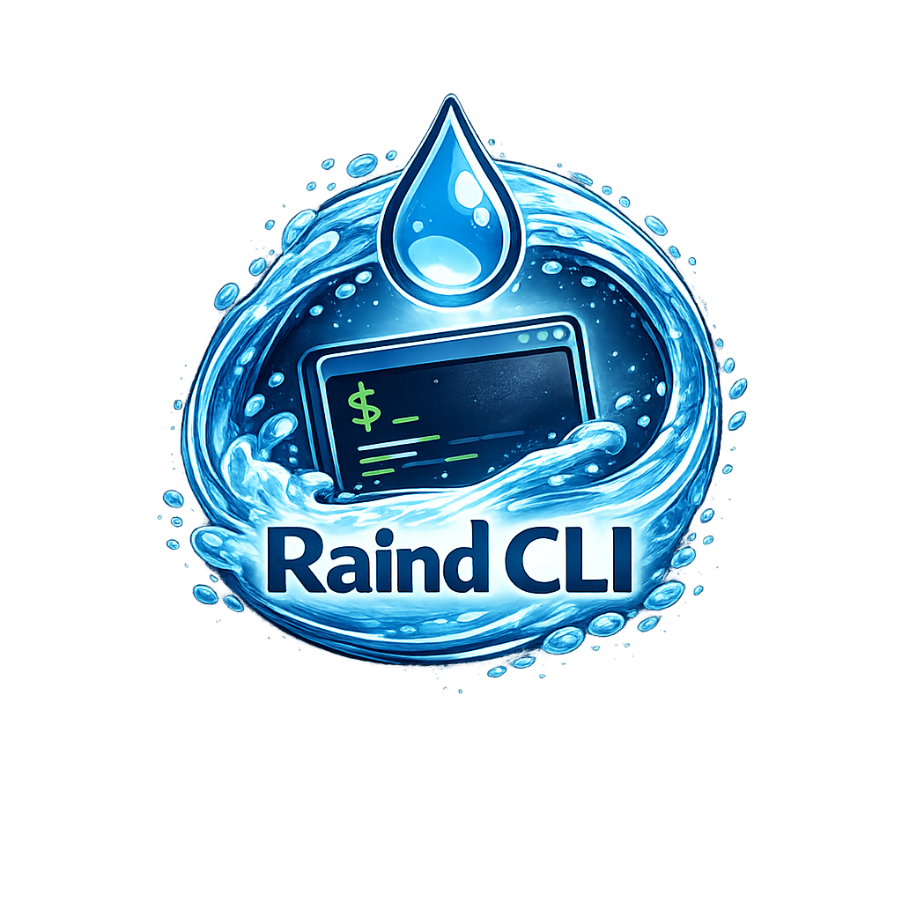

# Raind CLI
<p>
  
</p>
Raind CLI is the user-facing command-line interface of the Raind container runtime stack.
It provides a unified interface for creating, managing, and interacting with containers by communicating with the high-level container runtime via REST and WebSocket APIs.

Raind CLI itself does not directly manipulate namespaces, cgroups, or filesystems.
Instead, it translates user intent into API requests and delegates execution to the underlying runtime layers.

## Runtime Stack Architecture
The Raind container runtime stack is composed of three layers:

- **Raind CLI** – A command-line interface that accepts user input and controls the runtime stack
(this repository)

- **Condenser** – A high-level container runtime responsible for container lifecycle management, image handling, and state management  
(repository: https://github.com/pyxgun/Condenser)

- **Droplet** – A low-level container runtime that performs container setup and execution in an OCI-compliant manner  
(repository: https://github.com/pyxgun/Droplet)

Raind CLI communicates exclusively with Condenser using HTTP-based REST APIs.
For interactive containers, it establishes WebSocket connections to provide terminal I/O over pseudo-terminals.

## Features
Raind CLI currently supports:

- Resource operations via YAML (apply/delete)
- Container lifecycle operations (create, start, stop, delete)
- Listing containers and inspecting container state
- Executing commands inside running containers
- Attaching to containers with pseudo-terminals
- Interactive terminal sessions via WebSocket
- Image build/pull/remove/list
- Network create/remove/list
- Policy create/commit/revert/change-mode/list/remove
- Logs streaming
- REST-based communication with the high-level runtime
- Clear separation between user interface and runtime implementation

## Build
### Requirements
- Linux
- Go (version 1.24 or later)
- A running Condenser service
```bash
git clone git@github.com:pyxgun/Raind-CLI.git
go build -o bin/raind ./cmd/raind
```

## Usage
Raind CLI is intended to be used as the primary interface for operating the Raind container runtime stack.
It requires a running Condenser instance, which manages the underlying runtime environment.

### Pre-required Setup
Before using Raind CLI, ensure that:
- Condenser is running and accessible via its REST API endpoint
- Droplet is installed and available to Condenser

Raind CLI does not perform environment setup by itself.

## Command Examples
### resource
```bash
# apply resources from manifest
raind resource apply -f path/to/manifest.yaml

# remove resources defined in manifest
raind resource rm -f path/to/manifest.yaml

# pod operations (via resource)
raind resource pod create --name demo
raind resource pod ls
raind resource pod rm <pod-id>

# replicaset operations (via resource)
raind resource replicaset ls
raind resource replicaset show <replicaset-id>
raind resource replicaset scale <replicaset-id> --replicas 3
raind resource replicaset rm <replicaset-id>

# service operations (via resource)
raind resource service create -f path/to/service.yaml
raind resource service ls
raind resource service show <service-id>
raind resource service rm <service-id>
```

### container
```bash
# create a container as background process
raind container create <image:tag> [cmd(,arg1,arg2,...)]
# create a container with attaching tty
raind container create -t <image:tag> [cmd(,arg1,arg2,...)]

# start a container
raind container start <contianer-id>

# attach container
raind container attach <container-id>

# run a container (create+start[+attach,if -t specified])
raind container run [-t] [--rm] <image:tag>

# stop a container
raind container stop <container-id>

# remove a container
raind container rm <container-id>

# list containers
raind container ls
```

### bottle
```bash
# create a bottle from file
raind bottle create -f path/to/bottle.yaml

# start/stop bottle
raind bottle start <bottle-id>
raind bottle stop <bottle-id>

# show bottle detail
raind bottle show <bottle-id>

# list bottles
raind bottle ls

# delete bottle
raind bottle delete <bottle-id>
```

### image
```bash
# pull an image
raind image pull <image:tag>

# build an image from a Dripfile context
raind image build -f <context-dir> -t <image:tag>

# remove an image
raind image rm <image:tag>

# list images
raind image ls
```

### network
```bash
# create a network
raind network create <network-name>

# list networks
raind network ls

# remove a network
raind network rm <network-name>
```

### policy
```bash
# list policies
raind policy ls

# add a policy
raind policy add --type <ew|ns-obs|ns-enf> --source <container> --destination <container> [--protocol tcp|udp] [--dport <port>]

# commit/revert policy changes
raind policy commit
raind policy revert

# remove a policy
raind policy rm <policy-id>

# change policy mode
raind policy change-mode <enforce|permissive>
```

### logs
```bash
# container logs
raind container logs <container-id> [--line N] [--pager]

# netflow logs
raind logs netflow [--line N] [--pager] [--json] [--target <name|addr>]
```

### completion
```bash
# generate shell completion script
raind completion bash > /path/to/raind.bash
raind completion zsh > /path/to/_raind
raind completion fish > /path/to/raind.fish
```

## Design Philosophy
Raind CLI follows these design principles:
- **Thin interface**: All container logic is handled by Condenser and Droplet
- **Protocol-driven**: Communication is performed via explicit APIs (REST/WebSocket)
- **Composability**: The CLI can be replaced or extended without modifying runtime internals
- **Transparency**: Container state and behavior are observable through clear commands

## Status
Raind CLI and the Raind container runtime stack are currently under active development.
Command syntax, APIs, and behavior may change without notice.
