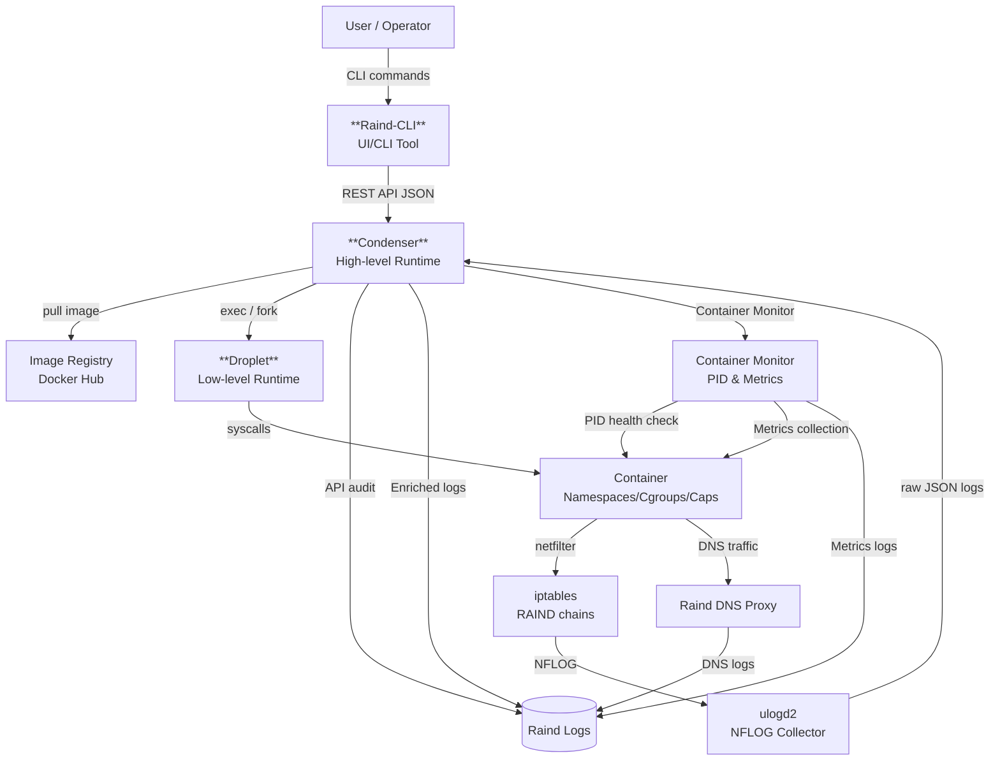

# Raind - Design Document
## 目的とスコープ
Raindは **Zero Trustをコンテナランタイムのレイヤで実装できるか** を検証するためのPoCです。

本ドキュメントは以下を目的としています。

- Raindの内部構成・責務分離を明確にする
- ネットワーク制御・ログ設計の意図を説明する
- 実装上の判断の理由を残す

本ドキュメントは安定APIの仕様書ではありません。設計判断の背景を共有するための設計資料となります。

## 全体アーキテクチャ



### Raind-CLI
Raindのオペレーションを行うUIツール  
*Repository: [https://github.com/shizuku198411/Raind-CLI](https://github.com/shizuku198411/Raind-CLI)

### Condenser
Raindにおける高レベルコンテナランタイム  
*Repository: [https://github.com/shizuku198411/Condenser](https://github.com/shizuku198411/Condenser)

### Droplet
Raindにおける低レベルコンテナランタイム  
*Repository: [https://github.com/shizuku198411/Droplet](https://github.com/shizuku198411/Droplet)

## コンテナライフサイクルと責務
### Condenserの責務
RainおいてCondenserが中枢機能を担っており、以下を一元管理しています。

- 管理API（mTLS+SPIFFE認可）と操作ログ
- コンテナ状態 (ID/名前/状態/時刻)
- ネットワーク情報 (IP/veth/bridge/forward)
- IPAM/CSM/ILM/NPMの永続ストア
- イメージ取得とローカル管理
- ネットワークポリシーとiptables管理チェーン
- Droplet Hookの受信と状態同期
- DNSプロキシとDNSログ
- NFLOGログのEnrichmentと監査ログ/メトリクス出力

## Condenser（高レベルランタイム）の設計詳細
Condenserは管理API・状態管理・ネットワーク/ポリシー・証明書・監視・ログの中枢を担います。
実装に基づく設計要点は以下の通りです。

### 起動とブートストラップ
起動時に以下をセットアップします。
- ランタイムディレクトリ（`/etc/raind/*`）作成
- IPAM/CSM/ILM/NPMのストア初期化
- cgroup v2のサブツリー作成とコントローラ有効化
- ブリッジ/masquerade/管理通信保護ルールの作成
- DNSプロキシ用IFとDNATの作成
- 事前定義ポリシー＋ユーザポリシーの反映
- 証明書（サーバ/CA/クライアント）の生成
- AppArmorプロファイルのセットアップ（失敗時は無効化で継続）

### APIサーバ構成と認可
Condenserは複数のHTTPSエンドポイントを持ちます。
- 管理API（`127.0.0.1:7755`）: コンテナ/イメージ/ポリシー/ネットワーク操作
- Hook API（`:7756`）: DropletからのHook通知
- CA API（`127.0.0.1:7757`）: CSR署名

すべてのAPIはmTLSを前提にし、クライアント証明書のSPIFFE ID検証による保護を行います。

### コンテナ作成フロー（Condenser側）
`create`時の主な流れは以下です。
1. コンテナID/名前を生成し、CSMに`creating`として登録
2. イメージの存在確認、未取得ならレジストリからPull
3. コンテナディレクトリ（rootfs/work/diff/etc/logs/cert）を作成
4. `/etc/hosts`・`/etc/hostname`・`/etc/resolv.conf`を生成
5. IPAMでIPを確保し、veth名/bridge/ゲートウェイ情報を確定
6. Droplet用の`config.json`を生成（Namespace/Env/Mount/Hook含む）
7. ポートフォワードがあればiptablesルールを追加
8. Dropletの`create`を呼び出し、低レベル起動へ移譲

### コンテナ起動・停止・削除
- `start`: 状態に応じてDroplet `start`を実行（stoppedの場合は`create`→`start`）
- `stop`: Droplet `kill`を実行
- `delete`: Droplet `delete`後にIP解放・転送ルール削除・ディレクトリ削除

CondenserはCSMで状態遷移を管理し、DropletからのHook通知により確定します。

### Droplet Hook と状態同期
CondenserはDroplet Hookを受け取りCSMと連携します。
- `createRuntime`/`createContainer`/`poststart`/`stopContainer`/`poststop`
- `createContainer`時にcgroupディレクトリを`555`へ変更
- `createContainer`/`poststop`でポリシーを再コミット

### ネットワーク管理
- IPAMはbridge単位のプールを管理し、IP/IF/vethを割当て
- 既定のbridge作成、MASQUERADE、管理通信保護のINPUTルールを追加
- `--publish`に相当する設定はDNAT/ FORWARDルールで実現
- コンテナからのDNSトラフィック:`udp/53`をRaind専用DNSプロキシへリダイレクト

### イメージ管理
- Docker Hub互換のレジストリからPull
- ローカルストアにbundle/config/rootfsのパスを保持
- コンテナからの参照が無い場合はローカルから削除

### Bottle（複数コンテナ）オーケストレーション
CondenserはBottle定義（YAML）を受け取り、依存関係を解決して複数コンテナを管理します。
- DAGにより起動順序を決定
- 依存サービスのアドレスを環境変数へ解決
- 必要に応じてBottle専用bridgeを自動作成

### 監視・メトリクス
CSMの更新を監視し、起動中コンテナを定期的にチェックします。
- pid監視により停止検知
- cgroup v2統計からCPU/Memory/IOを集計
- メトリクスはJSONLで出力

### Dropletの責務
Condenserによってコンテナ起動に必要となる環境のセットアップが完了した後、Dropletは以下のフローでコンテナを起動します。

1. コンテナ定義(config.json)を読み込み
2. Namespace/cgroup/capability/seccomp/AppArmor設定
3. veth作成、bridgeへ接続
4. コンテナ起動

Dropletはコンテナ起動に伴うLinuxカーネルに対する操作を責務とし、コンテナ実行に伴うリソースの整備、アドレスアサインといったコンテナ定義は全てCondenserに一任しています。

## Droplet（低レベルランタイム）の設計詳細
DropletはOCI spec（`config.json`）を基準に、プロセス/Namespace/FS/ネットワーク/セキュリティ制約を構成し、最終的に`execve`でコンテナプロセスへ移行します。
このセクションでは実装に基づく低レベルランタイムの設計要点を整理します。

### ライフサイクルの流れ
Dropletは`create → start → (run)`の2系統のフローを持ちます。

**create/start 系**
1. `create`で`config.json`を読み込み、`state.json`を`creating`で作成
2. `createRuntime`フック実行
3. FIFOを作成し、`init`サブコマンドを起動
4. cgroup v2とネットワーク(veth/bridge)を構成
5. `state.json`を`created`に更新
6. `createContainer`フック実行
7. `start`でFIFOを通じて`init`へ開始シグナル
8. `startContainer`/`poststart`フック実行、`state.json`を`running`へ更新

**run 系**
`create`と`start`を統合したフロー。呼び出し側はコンテナプロセスにアタッチし、終了まで待機します。

### `init`プロセスの責務
`init`はNamespace内で実行され、以下を順に行います。
- `config.json`の整合性検証（SHA-256ハッシュの一致確認）
- FIFO待機による起動同期
- Rootfs/Namespace内の環境構築
- AppArmor（`exec`適用）
- `execve`でエントリポイントへ置換

### Namespace / プロセス属性
OCI specに定義されたNamespaceをもとに`CLONE_NEW*`フラグを構成します。
`user` namespaceが有効な場合はUID/GIDのIDマッピングを生成し、Namespace内でroot権限に切り替えます。

### ファイルシステム初期化
RootfsはOCI annotationに含まれるイメージ情報から`overlayfs`で構成します。
`/proc`, `/sys`, `/dev`, `/dev/pts`, `/sys/fs/cgroup`, `/dev/shm`等の必須マウントを作成し、
`pivot_root`で新しいルートへ切り替えます。
標準デバイス（`/dev/null`等）はbind-mountで限定的に提供し、`/dev/fd`等のシンボリックリンクも生成します。

### cgroup v2制御
`memory.max`と`cpu.max`によりリソース制限を適用し、
`cgroup.procs`へPIDを登録することで対象プロセスを制限下に移動します。
あわせて`pids.max`でプロセス数の上限を設定します。

### ネットワーク構成
`config.json`内のannotationからネットワーク設定を取得し、以下を実行します。
- vethペア作成
- host側vethをbridgeへ接続・UP
- `nsenter`でコンテナnetnsへ入り、IP割当・ルート設定

### セキュリティ制約
- **Capabilities**: OCI specに沿ってBounding/Permitted/Effective等を適用
- **Seccomp**: BPFでdeny filterを構成し、危険なsyscallをERRNOで拒否
- **AppArmor**: `exec`時に指定プロファイルを適用（ホスト側事前ロード前提）

### OCI Hooks
OCI lifecycle hook（createRuntime/createContainer/startContainer/poststart/stopContainer/poststop）に対応。
必要に応じて`nsenter`でコンテナNamespace内から実行します。
各フック実行結果はauditログに記録されます。

### TTY / Attach と Exec
TTY有効時は`shim`がPTYを管理し、UNIX socketでCLIと接続します。
`exec`は`nsenter`でコンテナNamespaceに入って実行し、TTY付きの場合は`exec-shim`を利用します。

### 監査ログ
Dropletは`create/start/exec/kill`等のフェーズでauditログを出力し、
Namespace/Capabilities/Seccomp/LSM/AppArmor等の実行時情報も記録します。

## ネットワークモデル
### East-West (コンテナ間通信)
- bridge + vethを利用
- iptables `physdev` マッチによりvethペア単位で制御
- デフォルト: Deny

### North-South (外部通信)
- bridge → Host NIC
- モード切替:
    - Observe: 全許可+ログ (デフォルト)
    - Enforce: ポリシー未定義は拒否

## iptables設計
### 管理チェーン
Raindは `iptables` に専用の管理チェーンを持ちます。

- `RAIND-ROOT`
    - `RAIND-EW`
    - `RAIND-NS-OBS`
    - `RAIND-NS-ENF`

```
// Observeモード時
Chain RAIND-ROOT (1 references)
target        prot opt source     destination         
ACCEPT        all  --  anywhere   anywhere             ctstate RELATED,ESTABLISHED
RAIND-EW      all  --  anywhere   anywhere            
RAIND-NS-OBS  all  --  anywhere   anywhere            
RETURN        all  --  anywhere   anywhere 

// Enforceモード時
Chain RAIND-ROOT (1 references)
target        prot opt source     destination         
ACCEPT        all  --  anywhere   anywhere             ctstate RELATED,ESTABLISHED
RAIND-EW      all  --  anywhere   anywhere            
RAIND-NS-ENF  all  --  anywhere   anywhere            
RETURN        all  --  anywhere   anywhere 
```

### フル再構築方針
Raindはポリシー更新時の方針として以下を前提としています。
- 差分適用は行わない
- ポリシー更新時は管理チェーンをflush → 再構築

## ポリシー設計
### ポリシーの考え方
Raindはポリシーに対する考え方として以下を基本としています。

- ポリシーは宣言的
- **コンテナ**を主体とする (コンテナに割り振られたアドレス主体ではない)
- 通信を「許可する理由」を明示する

### ポリシーとiptablesの関係
- 1ポリシー → 1iptablesルール (+ログ)
- ポリシーIDをiptables `--nflog-prefix` へ埋め込み、逆引き可能とする

```
// Raindポリシー確認コマンド例
$ raind policy ls
FLAG: [*] - Applied, [+] - Apply next commit, [-] - Remove next commit, [ ] - Not applied

POLICY TYPE : East-West
CURRENT MODE: deny_by_default

FLAG  POLICY ID                   SRC CONTAINER  DST CONTAINER  PROTOCOL  DST PORT  ACTION  COMMENT  REASON
[*]   01kg1kgrpfdhbcgz81w4cqnxt0  src            dst            icmp      *         ALLOW            
  >> DENY ALL EAST-WEST TRAFFIC <<

============================
POLICY TYPE : North-South
CURRENT MODE: observe

FLAG  POLICY ID                   SRC CONTAINER  DST ADDR  PROTOCOL  DST PORT  ACTION  COMMENT  REASON
[*]   01kg1kh5dbf2xv1e0n1ramytmt  src            8.8.8.8   udp       53        DENY             
[*]   01kg1pf3780xxkzkfsnbc24fgw  src            1.1.1.1   icmp      *         DENY             
  >> ALLOW ALL NORTH-SOUTH TRAFFIC <<

// iptables
// East-West
Chain RAIND-EW (1 references)
target     prot opt source               destination         
NFLOG      icmp --  anywhere             anywhere             ctstate NEW PHYSDEV match --physdev-in rd_01kg1kbxsq3w --physdev-out rd_01kg1kbj56ft --physdev-is-bridged nflog-prefix "RAIND-EW-ALLOW,id=01kg1kgrpfdhbcgz81w4cqnxt0" nflog-group 10
ACCEPT     icmp --  anywhere             anywhere             PHYSDEV match --physdev-in rd_01kg1kbxsq3w --physdev-out rd_01kg1kbj56ft --physdev-is-bridged
NFLOG      all  --  anywhere             anywhere             ctstate NEW PHYSDEV match --physdev-is-bridged nflog-prefix "RAIND-EW-DENY,id=predefined" nflog-group 10
DROP       all  --  anywhere             anywhere            
RETURN     all  --  anywhere             anywhere 

// North-South
Chain RAIND-NS-OBS (1 references)
target     prot opt source               destination         
NFLOG      icmp --  10.166.0.2           one.one.one.one      ctstate NEW nflog-prefix "RAIND-NS-DENY,id=01kg1pf3780xxkzkfsnbc24fgw" nflog-group 11
DROP       icmp --  10.166.0.2           one.one.one.one     
NFLOG      udp  --  10.166.0.2           dns.google           ctstate NEW udp dpt:domain nflog-prefix "RAIND-NS-DENY,id=01kg1kh5dbf2xv1e0n1ramytmt" nflog-group 11
DROP       udp  --  10.166.0.2           dns.google           udp dpt:domain
NFLOG      all  --  anywhere             anywhere             ctstate NEW nflog-prefix "RAIND-NS-ALLOW,id=predefined" nflog-group 11
ACCEPT     all  --  anywhere             anywhere            
RETURN     all  --  anywhere             anywhere 
```

## ログ設計
### ログ生成の流れ
```
iptables (NFLOG)
    ↓
ulogd2 (raw JSON)
    ↓
Condenser (enrichment)
    ↓
Structured Enriched Log
```
ulogd2は
- NFLOGパケット収集
- 生ログのJSON出力
を目的とし、意味解釈はCondenserが行います。

CondenserはログEnrichmentに加え、以下を出力します。
- API監査ログ（mTLS情報/操作対象/結果/遅延）
- DNSプロキシログ
- コンテナメトリクス（CPU/Memory/IO）

### Log Enrichment
Condenserは以下を突合します。
- rawログ (5-tuple等)
- Condenserが保持するコンテナ状態
    -  IP → コンテナID/コンテナ名/veth

これにより、
- 通信の主体 (どのコンテナが)
- 通信の方向 (East-West/North-South)
- 判定結果 (allow/deny)
- 適用ポリシー

を **1レコードで説明可能なログ** として出力します。

### ログスキーマ (v1)
ログ出力パス:
- トラフィック（Enriched）: `/var/log/raind/raind_netflow.jsonl`
- DNS: `/var/log/raind/raind_dns.jsonl`
- 監査（API）: `/var/log/raind/raind_audit.jsonl`
- メトリクス: `/var/log/raind/raind_metrics.jsonl`

#### トラフィックログ
- `generated_ts`: イベント発生時刻 (ulogd由来)
- `received_ts`: Condenser受信時刻
- `policy`:
    - `source`: ポリシーソース(user / predefined)
    - `id`: ポリシーID
- `kind`: 通信種別 (East-West/North-South)
- `verdict`: 判定 (allow/deny)
- `proto`: プロトコル
- `src`/`dst`:
    - `kind`: 通信主体種別 (cotainer/external)
    - `ip`: IPアドレス
    - `port`: ポート
    - `container_id`: コンテナID
    - `container_name`: コンテナ名
    - `veth`: コンテナveth

```json
// example
{
  "generated_ts": "2026-01-28T16:00:23.594406+0900",
  "received_ts": "2026-01-28T16:00:24.800043049+09:00",
  "policy": {
    "source": "user",
    "id": "01kg1kh5dbf2xv1e0n1ramytmt"
  },
  "kind": "north-south",
  "verdict": "deny",
  "proto": "UDP",
  "src": {
    "kind": "container",
    "ip": "10.166.0.2",
    "port": 37527,
    "container_id": "01kg1kbxsq3w",
    "container_name": "src",
    "veth": "rd_01kg1kbxsq3w"
  },
  "dst": {
    "kind": "external",
    "ip": "8.8.8.8",
    "port": 53
  },
  "rule_hint": "RAIND-NS-DENY,id=01kg1kh5dbf2xv1e0n1ramytmt",
  "raw_hash": "6ebaa019da4f98d529ef48f432ce398c3e20f7a01fc26592f98afb325859479d"
}
```

#### DNSログ
- `generated_ts`: 生成時刻
- `event_type`: イベント種別（`log.traffic`）
- `network.transport`: `udp` / `tcp`
- `src`: DNSクライアント情報（IP/port/コンテナID/名前/spiffe/veth）
- `dns`:
    - `id`: DNS transaction ID
    - `rd`: recursion desired
    - `question`: `name`/`type`/`class`
    - `response`: `rcode`/`answers`/`authority`/`additional`/`truncated`
- `upstream`: 利用したUpstrema Server
- `latency_ms`: upstream問い合わせ時間
- `cache.hit`: キャッシュヒット
- `query_result`: `ok`/`fail`
- `note`: 失敗理由等

```json
// example
{
  "generated_ts": "2026-01-28T16:00:23.594406+09:00",
  "event_type": "log.traffic",
  "network": {
    "transport": "udp"
  },
  "src": {
    "ip": "10.166.0.2",
    "port": 53321,
    "container_id": "01kg1kbxsq3w",
    "container_name": "src",
    "spiffe_id": "spiffe://raind/container/01kg1kbxsq3w",
    "veth": "rd_01kg1kbxsq3w"
  },
  "dns": {
    "id": 32012,
    "rd": true,
    "question": {
      "name": "example.com.",
      "type": "A",
      "class": "IN"
    },
    "response": {
      "rcode": "NOERROR",
      "answers": 1,
      "authority": 0,
      "additional": 0,
      "truncated": false
    }
  },
  "upstream": {
    "server": "8.8.8.8:53",
    "transport": "udp"
  },
  "latency_ms": 12,
  "cache": {
    "hit": false
  },
  "query_result": "ok",
  "note": "hit=false"
}
```

#### 監査ログ（API）
- `generated_ts`: 生成時刻
- `event_id`: イベントID
- `correlation_id`: リクエストID
- `severity`: severity
- `actor`: `spiffe_id`/`certt_fingerprint`/`peer_ip`
- `action`: アクション（例: `container.create`, `policy.commit`）
- `target`: 対象（container/policy/pki など）
- `request`: `method`/`path`/`host`
- `result`: `status`/`code`/`reason`/`bytes`/`latence_ms`
- `runtime`: `component`/`node`
- `extra`: 追加情報

```json
// example
{
  "generated_ts": "2026-01-28T16:01:10.123456+09:00",
  "event_id": "0fd6b3a4-4c3c-4c47-9c9e-1c3f0c8b3a2d",
  "correlation_id": "b26b9e2c5f0f1a7d",
  "severity": "medium",
  "actor": {
    "spiffe_id": "spiffe://raind/cli/admin",
    "certt_fingerprint": "9b2b8a2f2a5b9b1a6a9d2b5c1a2f3e4b5c6d7e8f9a0b1c2d3e4f5a6b7c8d9e0f",
    "peer_ip": "127.0.0.1"
  },
  "action": "container.create",
  "target": {
    "container_name": "web",
    "image_ref": "alpine:latest",
    "command": ["/bin/sh"]
  },
  "request": {
    "method": "POST",
    "path": "/v1/containers",
    "host": "127.0.0.1:7755"
  },
  "result": {
    "status": "allow",
    "code": 200,
    "bytes": 120,
    "latence_ms": 35
  },
  "runtime": {
    "component": "condenser",
    "node": "raind-node"
  }
}
```

#### Metrics
- `generated_ts`: 生成時刻
- `container_id`/`container_name`/`spiffe_id`/`pid`/`status`
- `cgroup_path`: cgroup v2パス
- CPU: `cpu_usage_usec`/`cpu_user_usec`/`cpu_system_usec`/`cpu_nr_periods`/`cpu_nr_throttled`/`cpu_throttled_usec`/`cpu_quota_usec`/`cpu_period_usec`/`cpu_unlimited`/`cpu_percent`
- Memory: `memory_current_bytes`/`memory_max_bytes`/`memory_limited`/`memory_percent`
- IO: `io_read_bytes`/`io_write_bytes`/`io_read_ops`/`io_write_ops`
- OOM: `memory_oom`/`memory_oom_kill`

```json
// example
{
  "generated_ts": "2026-01-28T16:02:00.000000+09:00",
  "container_id": "01kg1kbxsq3w",
  "container_name": "src",
  "spiffe_id": "spiffe://raind/container/01kg1kbxsq3w",
  "pid": 12345,
  "status": "running",
  "cgroup_path": "/sys/fs/cgroup/raind/01kg1kbxsq3w",
  "cpu_usage_usec": 1234567,
  "cpu_user_usec": 800000,
  "cpu_system_usec": 434567,
  "cpu_nr_periods": 1200,
  "cpu_nr_throttled": 10,
  "cpu_throttled_usec": 5000,
  "cpu_quota_usec": 80000,
  "cpu_period_usec": 100000,
  "cpu_unlimited": false,
  "cpu_percent": 12.5,
  "memory_current_bytes": 52428800,
  "memory_max_bytes": 1073741824,
  "memory_limited": true,
  "memory_percent": 4.88,
  "io_read_bytes": 1048576,
  "io_write_bytes": 2097152,
  "io_read_ops": 120,
  "io_write_ops": 240,
  "memory_oom": 0,
  "memory_oom_kill": 0
}
```
