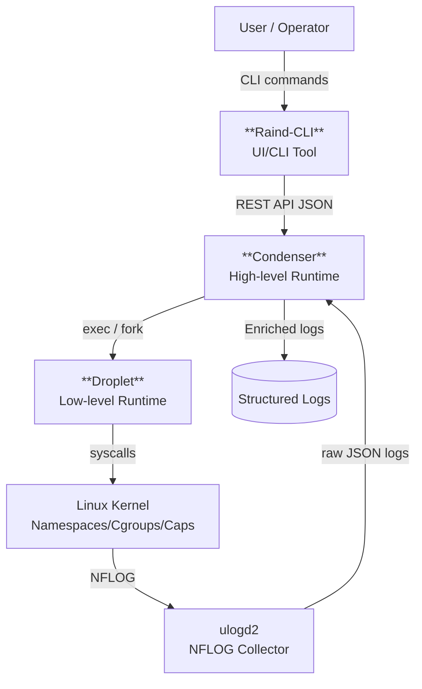

# Raind - Design Document
## 目的とスコープ
Raindは **Zero Trustをコンテナランタイムのレイヤで実装できるか** を検証するためのPoCです。

本ドキュメントは以下を目的としています。

- Raindの内部構成・責務分離を明確にする
- ネットワーク制御・ログ設計の意図を説明する
- 実装上の判断の理由を残す

本ドキュメントは安定APIの仕様書ではありません。設計判断の背景を共有するための設計資料となります。

## 全体アーキテクチャ
Raindは大きく以下のコンポーネントから構成されます。



### Raind-CLI
Raindのオペレーションを行うUIツール  
*Repository: [https://github.com/shizuku198411/Raind-CLI](https://github.com/shizuku198411/Raind-CLI)

### Condenser
Raindにおける高レベルコンテナランタイム  
*Repository: [https://github.com/shizuku198411/Condenser](https://github.com/shizuku198411/Condenser)

### Droplet
Raindにおける低レベルコンテナランタイム  
*Repository: [https://github.com/shizuku198411/Droplet](https://github.com/shizuku198411/Droplet)

## コンテナライフサイクルと責務
### Condenserの責務
RainおいてCondenserが中枢機能を担っており、以下を一元管理しています。

- コンテナ状態 (ID/名前/状態)
- ネットワーク情報 (IP/veth/bridge)
- IPAM (IP Address Management)
- ネットワークポリシー
- iptables管理チェーン
- ログEnrichment

重要な設計方針として

> Condenserは「単一の真実(SSOT)」としてコンテナ状態を保持する

### Dropletの責務
Condenserによってコンテナ起動に必要となる環境のセットアップが完了した後、Dropletは以下のフローでコンテナを起動します。

1. コンテナ定義(config.json)を読み込み
2. Namespace/cgroup/capability/seccomp/AppArmor設定
3. veth作成、bridgeへ接続
4. コンテナ起動

Dropletはコンテナ起動に伴うLinuxカーネルに対する操作を責務とし、コンテナ実行に伴うリソースの整備、アドレスアサインといったコンテナ定義は全てCondenserに一任しています。

## ネットワークモデル
### East-West (コンテナ間通信)
- bridge + vethを利用
- iptables `physdev` マッチによりvethペア単位で制御
- デフォルト: Deny

設計意図:  
- コンテナ間通信は「明示的に許可されたもののみ」
- 依存関係をポリシーとして可視化する

### North-South (外部通信)
- bridge → Host NIC
- モード切替:
    - Observe: 全許可+ログ (デフォルト)
    - Enforce: ポリシー未定義は拒否

設計意図:
- いきなり遮断しない
- 実通信を見ながらポリシー設計できるようにする

## iptables設計
### 管理チェーン
Raindは `iptables` に専用の管理チェーンを持ちます。

- `RAIND-ROOT`
    - `RAIND-EW`
    - `RAIND-NS-OBS`
    - `RAIND-NS-ENF`

```
// Observeモード時
Chain RAIND-ROOT (1 references)
target        prot opt source     destination         
ACCEPT        all  --  anywhere   anywhere             ctstate RELATED,ESTABLISHED
RAIND-EW      all  --  anywhere   anywhere            
RAIND-NS-OBS  all  --  anywhere   anywhere            
RETURN        all  --  anywhere   anywhere 

// Enforceモード時
Chain RAIND-ROOT (1 references)
target        prot opt source     destination         
ACCEPT        all  --  anywhere   anywhere             ctstate RELATED,ESTABLISHED
RAIND-EW      all  --  anywhere   anywhere            
RAIND-NS-ENF  all  --  anywhere   anywhere            
RETURN        all  --  anywhere   anywhere 
```

設計意図:
- 既存チェーンに直接ルールを定義しない
- FORWARD/POSTROUTINGからジャンプするのみ
- Raind管理チェーンはポリシー更新時に **フル再構築** できるようにする

### フル再構築方針
Raindはポリシー更新時の方針として以下を前提としています。
- 差分適用は行わない
- ポリシー更新時は管理チェーンをflush → 再構築

設計意図:
- 途中状態の排除
- ルール順序不整合等の回避
- 冪等性の確保

## ポリシー設計
### ポリシーの考え方
Raindはポリシーに対する考え方として以下を基本としています。

- ポリシーは宣言的
- **コンテナ**を主体とする (コンテナに割り振られたアドレス主体ではない)
- 通信を「許可する理由」を明示する

### ポリシーとiptablesの関係
- 1ポリシー → 1iptablesルール (+ログ)
- ポリシーIDをiptables `--nflog-prefix` へ埋め込み、逆引き可能とする

```
// Raindポリシー確認コマンド例
$ raind policy ls
FLAG: [*] - Applied, [+] - Apply next commit, [-] - Remove next commit, [ ] - Not applied

POLICY TYPE : East-West
CURRENT MODE: deny_by_default

FLAG  POLICY ID                   SRC CONTAINER  DST CONTAINER  PROTOCOL  DST PORT  ACTION  COMMENT  REASON
[*]   01kg1kgrpfdhbcgz81w4cqnxt0  src            dst            icmp      *         ALLOW            
  >> DENY ALL EAST-WEST TRAFFIC <<

============================
POLICY TYPE : North-South
CURRENT MODE: observe

FLAG  POLICY ID                   SRC CONTAINER  DST ADDR  PROTOCOL  DST PORT  ACTION  COMMENT  REASON
[*]   01kg1kh5dbf2xv1e0n1ramytmt  src            8.8.8.8   udp       53        DENY             
[*]   01kg1pf3780xxkzkfsnbc24fgw  src            1.1.1.1   icmp      *         DENY             
  >> ALLOW ALL NORTH-SOUTH TRAFFIC <<

// iptables
// East-West
Chain RAIND-EW (1 references)
target     prot opt source               destination         
NFLOG      icmp --  anywhere             anywhere             ctstate NEW PHYSDEV match --physdev-in rd_01kg1kbxsq3w --physdev-out rd_01kg1kbj56ft --physdev-is-bridged nflog-prefix "RAIND-EW-ALLOW,id=01kg1kgrpfdhbcgz81w4cqnxt0" nflog-group 10
ACCEPT     icmp --  anywhere             anywhere             PHYSDEV match --physdev-in rd_01kg1kbxsq3w --physdev-out rd_01kg1kbj56ft --physdev-is-bridged
NFLOG      all  --  anywhere             anywhere             ctstate NEW PHYSDEV match --physdev-is-bridged nflog-prefix "RAIND-EW-DENY,id=predefined" nflog-group 10
DROP       all  --  anywhere             anywhere            
RETURN     all  --  anywhere             anywhere 

// North-South
Chain RAIND-NS-OBS (1 references)
target     prot opt source               destination         
NFLOG      icmp --  10.166.0.2           one.one.one.one      ctstate NEW nflog-prefix "RAIND-NS-DENY,id=01kg1pf3780xxkzkfsnbc24fgw" nflog-group 11
DROP       icmp --  10.166.0.2           one.one.one.one     
NFLOG      udp  --  10.166.0.2           dns.google           ctstate NEW udp dpt:domain nflog-prefix "RAIND-NS-DENY,id=01kg1kh5dbf2xv1e0n1ramytmt" nflog-group 11
DROP       udp  --  10.166.0.2           dns.google           udp dpt:domain
NFLOG      all  --  anywhere             anywhere             ctstate NEW nflog-prefix "RAIND-NS-ALLOW,id=predefined" nflog-group 11
ACCEPT     all  --  anywhere             anywhere            
RETURN     all  --  anywhere             anywhere 
```

## ログ設計
### ログ生成の流れ
```
iptables (NFLOG)
    ↓
ulogd2 (raw JSON)
    ↓
Condenser (enrichment)
    ↓
Structured Enriched Log
```
ulogd2は
- NFLOGパケット収集
- 生ログのJSON出力
を目的とし、意味解釈はCondenserが行います。

### Log Enrichment
Condenserは以下を突合します。
- rawログ (5-tuple等)
- Condenserが保持するコンテナ状態
    -  IP → コンテナID/コンテナ名/veth

これにより、
- 通信の主体 (どのコンテナが)
- 通信の方向 (East-West/North-South)
- 判定結果 (allow/deny)
- 適用ポリシー

を **1レコードで説明可能なログ** として出力します。

### ログスキーマ (v1)
- `generated_ts`: イベント発生時刻 (ulogd由来)
- `received_ts`: Condenser受信時刻
- `policy`:
    - `source`: ポリシーソース(user / predefined)
    - `id`: ポリシーID
- `kind`: 通信種別 (East-West/North-South)
- `verdict`: 判定 (allow/deny)
- `proto`: プロトコル
- `src`/`dst`:
    - `kind`: 通信主体種別 (cotainer/external)
    - `ip`: IPアドレス
    - `port`: ポート
    - `container_id`: コンテナID
    - `container_name`: コンテナ名
    - `veth`: コンテナveth

```json
// example
{
  "generated_ts": "2026-01-28T16:00:23.594406+0900",
  "received_ts": "2026-01-28T16:00:24.800043049+09:00",
  "policy": {
    "source": "user",
    "id": "01kg1kh5dbf2xv1e0n1ramytmt"
  },
  "kind": "north-south",
  "verdict": "deny",
  "proto": "UDP",
  "src": {
    "kind": "container",
    "ip": "10.166.0.2",
    "port": 37527,
    "container_id": "01kg1kbxsq3w",
    "container_name": "src",
    "veth": "rd_01kg1kbxsq3w"
  },
  "dst": {
    "kind": "external",
    "ip": "8.8.8.8",
    "port": 53
  },
  "rule_hint": "RAIND-NS-DENY,id=01kg1kh5dbf2xv1e0n1ramytmt",
  "raw_hash": "6ebaa019da4f98d529ef48f432ce398c3e20f7a01fc26592f98afb325859479d"
}
```
