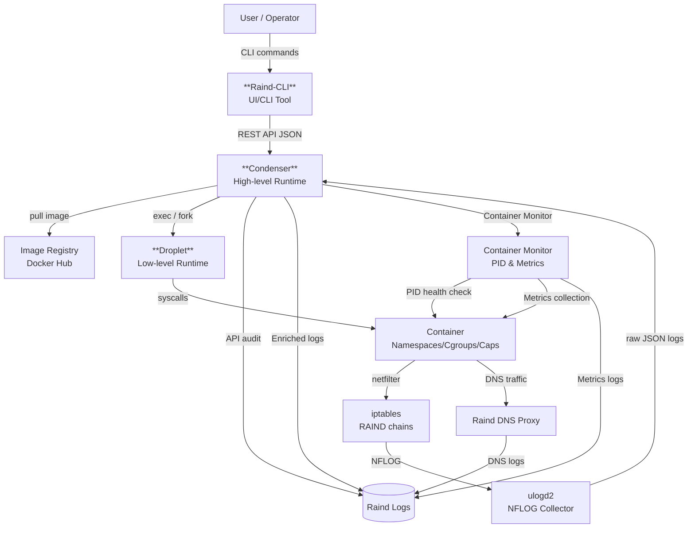

# Raind - Design Document
## Purpose and Scope
Raind is a PoC to evaluate whether **Zero Trust can be implemented at the container runtime layer**.

This document aims to:
- Clarify Raind's internal structure and responsibility boundaries
- Explain the intent behind network control and logging design
- Record the rationale for implementation decisions

This is not a stable API specification. It is a design document to share decision context.

## Overall Architecture



### Raind-CLI
UI tool for operating Raind.  
*Repository: [https://github.com/shizuku198411/Raind-CLI](https://github.com/shizuku198411/Raind-CLI)

### Condenser
High-level container runtime in Raind.  
*Repository: [https://github.com/shizuku198411/Condenser](https://github.com/shizuku198411/Condenser)

### Droplet
Low-level container runtime in Raind.  
*Repository: [https://github.com/shizuku198411/Droplet](https://github.com/shizuku198411/Droplet)

## Container Lifecycle and Responsibilities
### Condenser Responsibilities
Condenser is the central component and manages:
- Management API (mTLS + SPIFFE authorization) and operation logs
- Container state (ID/name/status/timestamps)
- Network info (IP/veth/bridge/forward)
- Persistent stores for IPAM/CSM/ILM/NPM
- Image pull and local management
- Network policies and iptables management chains
- Droplet hook reception and state sync
- DNS proxy and DNS logs
- NFLOG enrichment and audit logs/metrics output

## Condenser (High-Level Runtime) Design Details
Condenser is the hub for management API, state, network/policy, certificates, monitoring, and logging.  
Key design points:

### Startup and Bootstrap
On startup it sets up:
- Runtime directories (`/etc/raind/*`)
- IPAM/CSM/ILM/NPM store initialization
- cgroup v2 subtree and controller activation
- Bridge/masquerade/management-protection rules
- DNS proxy interface and DNAT
- Predefined policies + user policies
- Certificates (server/CA/client)
- AppArmor profiles (continue with disabled if setup fails)

### API Server and Authorization
Condenser exposes multiple HTTPS endpoints:
- Management API (`127.0.0.1:7755`): container/image/policy/network operations
- Hook API (`:7756`): hook notifications from Droplet
- CA API (`127.0.0.1:7757`): CSR signing

All APIs require mTLS and validate client SPIFFE IDs.

### Container Create Flow (Condenser Side)
Main steps for `create`:
1. Generate container ID/name and register as `creating` in CSM
2. Verify image; pull from registry if missing
3. Create container directories (rootfs/work/diff/etc/logs/cert)
4. Generate `/etc/hosts`, `/etc/hostname`, `/etc/resolv.conf`
5. Allocate IP from IPAM and determine veth/bridge/gateway
6. Generate `config.json` for Droplet (Namespace/Env/Mount/Hook)
7. Add iptables rules for port forwards if any
8. Call Droplet `create` and hand off to low-level start

### Start/Stop/Delete
- `start`: run Droplet `start` based on state (if stopped, run `create` -> `start`)
- `stop`: run Droplet `kill`
- `delete`: run Droplet `delete`, then release IP, remove forwarding rules, delete directories

Condenser manages state transitions in CSM and finalizes via Droplet hook notifications.

### Droplet Hooks and State Sync
Condenser receives Droplet hooks and updates CSM.
- `createRuntime`/`createContainer`/`poststart`/`stopContainer`/`poststop`
- Set cgroup directory to `555` during `createContainer`
- Re-commit policies on `createContainer`/`poststop`

### Network Management
- IPAM manages per-bridge pools and assigns IP/IF/veth
- Create default bridge, MASQUERADE, and management protection INPUT rules
- `--publish` is implemented via DNAT/FORWARD rules
- DNS traffic `udp/53` is redirected to Raind DNS proxy

### Image Management
- Pull from Docker Hub-compatible registries
- Keep bundle/config/rootfs paths in local store
- Remove unused images from local store

### Bottle (Multi-Container) Orchestration
Condenser accepts Bottle YAML and manages multiple containers by resolving dependencies.
- Determine start order via DAG
- Resolve dependent service addresses into environment variables
- Auto-create a dedicated bridge if needed

### Monitoring and Metrics
Monitors CSM updates and periodically checks running containers.
- Detect stop via PID monitoring
- Collect CPU/Memory/IO from cgroup v2
- Output metrics as JSONL

### Droplet Responsibilities
After Condenser prepares the environment, Droplet starts containers:
1. Read container definition (`config.json`)
2. Configure namespace/cgroup/capability/seccomp/AppArmor
3. Create veth and attach to bridge
4. Launch container

Droplet is responsible for kernel-level container execution. Resource setup, address assignment, and definitions are handled by Condenser.

## Droplet (Low-Level Runtime) Design Details
Droplet follows the OCI spec (`config.json`) to set up process/namespace/FS/network/security constraints and then `execve` into the container process.  
Key design points:

### Lifecycle Flow
Droplet has two flows: `create -> start -> (run)`.

**create/start flow**
1. On `create`, read `config.json` and create `state.json` with `creating`
2. Run `createRuntime` hook
3. Create FIFO and start `init` subcommand
4. Configure cgroup v2 and network (veth/bridge)
5. Update `state.json` to `created`
6. Run `createContainer` hook
7. On `start`, send start signal to `init` via FIFO
8. Run `startContainer`/`poststart` hooks and update `state.json` to `running`

**run flow**
Combines `create` and `start`. The caller attaches to the container process and waits for exit.

### `init` Process Responsibilities
`init` runs inside namespaces and performs:
- Validate `config.json` (SHA-256 hash match)
- Startup synchronization via FIFO
- Setup rootfs and namespace environment
- Apply AppArmor on `exec`
- Replace with entrypoint via `execve`

### Namespace / Process Attributes
Based on OCI namespaces, build `CLONE_NEW*` flags.  
If `user` namespace is enabled, generate UID/GID mappings and switch to root inside the namespace.

### Filesystem Initialization
Rootfs is built with `overlayfs` using OCI annotations.  
Create required mounts such as `/proc`, `/sys`, `/dev`, `/dev/pts`, `/sys/fs/cgroup`, `/dev/shm`, then switch root via `pivot_root`.  
Standard devices (e.g., `/dev/null`) are bind-mounted and symlinks like `/dev/fd` are created.

### cgroup v2 Control
Apply limits via `memory.max` and `cpu.max`, then move processes by writing PIDs to `cgroup.procs`.  
Also set process limits via `pids.max`.

### Network Setup
Use annotations in `config.json`:
- Create veth pair
- Attach host veth to bridge and bring it up
- Enter container netns with `nsenter`, assign IP and routes

### Security Constraints
- **Capabilities**: apply Bounding/Permitted/Effective per OCI spec
- **Seccomp**: build BPF deny filters and return ERRNO for unsafe syscalls
- **AppArmor**: apply profile on `exec` (requires preloading on host)

### OCI Hooks
Supports OCI lifecycle hooks (createRuntime/createContainer/startContainer/poststart/stopContainer/poststop).  
Runs hooks inside container namespaces with `nsenter` when needed.  
Hook results are recorded in audit logs.

### TTY / Attach and Exec
With TTY enabled, `shim` manages PTY and connects to CLI via UNIX socket.  
`exec` enters container namespaces with `nsenter`, and uses `exec-shim` when TTY is requested.

### Audit Logs
Droplet outputs audit logs for phases such as `create/start/exec/kill`, including runtime info for Namespace/Capabilities/Seccomp/LSM/AppArmor.

## Network Model
### East-West (Container-to-Container)
- Bridge + veth
- Controlled per veth pair with iptables `physdev` match
- Default: Deny

### North-South (External)
- Bridge -> Host NIC
- Modes:
  - Observe: allow all + log (default)
  - Enforce: deny unless policy exists

## iptables Design
### Management Chains
Raind has dedicated management chains in `iptables`.

Chains:
- `RAIND-ROOT`
- `RAIND-EW`
- `RAIND-NS-OBS`
- `RAIND-NS-ENF`

```
// Observe mode
Chain RAIND-ROOT (1 references)
target        prot opt source     destination         
ACCEPT        all  --  anywhere   anywhere             ctstate RELATED,ESTABLISHED
RAIND-EW      all  --  anywhere   anywhere            
RAIND-NS-OBS  all  --  anywhere   anywhere            
RETURN        all  --  anywhere   anywhere 

// Enforce mode
Chain RAIND-ROOT (1 references)
target        prot opt source     destination         
ACCEPT        all  --  anywhere   anywhere             ctstate RELATED,ESTABLISHED
RAIND-EW      all  --  anywhere   anywhere            
RAIND-NS-ENF  all  --  anywhere   anywhere            
RETURN        all  --  anywhere   anywhere 
```

### Full Rebuild Policy
Raind assumes the following policy update strategy:
- No incremental diff application
- On policy updates, flush and rebuild management chains

## Policy Design
### Policy Principles
Raind policies are based on:
- Declarative definition
- Container-centric (not IP-centric)
- Make the reason for allowing traffic explicit

### Policy and iptables Relationship
- One policy -> one iptables rule (+ log)
- Embed policy ID in iptables `--nflog-prefix` for reverse lookup

```
// Example: policy list
$ raind policy ls
FLAG: [*] - Applied, [+] - Apply next commit, [-] - Remove next commit, [ ] - Not applied

POLICY TYPE : East-West
CURRENT MODE: deny_by_default

FLAG  POLICY ID                   SRC CONTAINER  DST CONTAINER  PROTOCOL  DST PORT  ACTION  COMMENT  REASON
[*]   01kg1kgrpfdhbcgz81w4cqnxt0  src            dst            icmp      *         ALLOW            
  >> DENY ALL EAST-WEST TRAFFIC <<

============================
POLICY TYPE : North-South
CURRENT MODE: observe

FLAG  POLICY ID                   SRC CONTAINER  DST ADDR  PROTOCOL  DST PORT  ACTION  COMMENT  REASON
[*]   01kg1kh5dbf2xv1e0n1ramytmt  src            8.8.8.8   udp       53        DENY             
[*]   01kg1pf3780xxkzkfsnbc24fgw  src            1.1.1.1   icmp      *         DENY             
  >> ALLOW ALL NORTH-SOUTH TRAFFIC <<

// iptables
// East-West
Chain RAIND-EW (1 references)
target     prot opt source               destination         
NFLOG      icmp --  anywhere             anywhere             ctstate NEW PHYSDEV match --physdev-in rd_01kg1kbxsq3w --physdev-out rd_01kg1kbj56ft --physdev-is-bridged nflog-prefix "RAIND-EW-ALLOW,id=01kg1kgrpfdhbcgz81w4cqnxt0" nflog-group 10
ACCEPT     icmp --  anywhere             anywhere             PHYSDEV match --physdev-in rd_01kg1kbxsq3w --physdev-out rd_01kg1kbj56ft --physdev-is-bridged
NFLOG      all  --  anywhere             anywhere             ctstate NEW PHYSDEV match --physdev-is-bridged nflog-prefix "RAIND-EW-DENY,id=predefined" nflog-group 10
DROP       all  --  anywhere             anywhere            
RETURN     all  --  anywhere             anywhere 

// North-South
Chain RAIND-NS-OBS (1 references)
target     prot opt source               destination         
NFLOG      icmp --  10.166.0.2           one.one.one.one      ctstate NEW nflog-prefix "RAIND-NS-DENY,id=01kg1pf3780xxkzkfsnbc24fgw" nflog-group 11
DROP       icmp --  10.166.0.2           one.one.one.one     
NFLOG      udp  --  10.166.0.2           dns.google           ctstate NEW udp dpt:domain nflog-prefix "RAIND-NS-DENY,id=01kg1kh5dbf2xv1e0n1ramytmt" nflog-group 11
DROP       udp  --  10.166.0.2           dns.google           udp dpt:domain
NFLOG      all  --  anywhere             anywhere             ctstate NEW nflog-prefix "RAIND-NS-ALLOW,id=predefined" nflog-group 11
ACCEPT     all  --  anywhere             anywhere            
RETURN     all  --  anywhere             anywhere 
```

## Log Design
### Log Flow
```
iptables (NFLOG)
    v
ulogd2 (raw JSON)
    v
Condenser (enrichment)
    v
Structured Enriched Log
```
ulogd2 is responsible for:
- NFLOG packet collection
- JSON output of raw logs

Condenser performs enrichment and outputs:
- API audit logs (mTLS info/targets/results/latency)
- DNS proxy logs
- Container metrics (CPU/Memory/IO)

### Log Enrichment
Condenser correlates:
- Raw logs (5-tuple, etc.)
- Container state held by Condenser
  - IP -> container ID/name/veth

This yields a **single record** that explains:
- Traffic subject (which container)
- Direction (East-West/North-South)
- Verdict (allow/deny)
- Applied policy

### Log Schema (v1)
Output paths:
- Traffic (Enriched): `/var/log/raind/raind_netflow.jsonl`
- DNS: `/var/log/raind/raind_dns.jsonl`
- Audit (API): `/var/log/raind/raind_audit.jsonl`
- Metrics: `/var/log/raind/raind_metrics.jsonl`

#### Traffic Logs
- `generated_ts`: event time (from ulogd)
- `received_ts`: time received by Condenser
- `policy`:
  - `source`: policy source (user / predefined)
  - `id`: policy ID
- `kind`: traffic kind (East-West/North-South)
- `verdict`: allow/deny
- `proto`: protocol
- `src`/`dst`:
  - `kind`: subject (container/external)
  - `ip`: IP address
  - `port`: port
  - `container_id`: container ID
  - `container_name`: container name
  - `veth`: container veth

```json
// example
{
  "generated_ts": "2026-01-28T16:00:23.594406+0900",
  "received_ts": "2026-01-28T16:00:24.800043049+09:00",
  "policy": {
    "source": "user",
    "id": "01kg1kh5dbf2xv1e0n1ramytmt"
  },
  "kind": "north-south",
  "verdict": "deny",
  "proto": "UDP",
  "src": {
    "kind": "container",
    "ip": "10.166.0.2",
    "port": 37527,
    "container_id": "01kg1kbxsq3w",
    "container_name": "src",
    "veth": "rd_01kg1kbxsq3w"
  },
  "dst": {
    "kind": "external",
    "ip": "8.8.8.8",
    "port": 53
  },
  "rule_hint": "RAIND-NS-DENY,id=01kg1kh5dbf2xv1e0n1ramytmt",
  "raw_hash": "6ebaa019da4f98d529ef48f432ce398c3e20f7a01fc26592f98afb325859479d"
}
```

#### DNS Logs
- `generated_ts`: generated time
- `event_type`: event type (`log.traffic`)
- `network.transport`: `udp` / `tcp`
- `src`: DNS client info (IP/port/container ID/name/spiffe/veth)
- `dns`:
  - `id`: DNS transaction ID
  - `rd`: recursion desired
  - `question`: `name`/`type`/`class`
  - `response`: `rcode`/`answers`/`authority`/`additional`/`truncated`
- `upstream`: upstream server
- `latency_ms`: upstream query latency
- `cache.hit`: cache hit
- `query_result`: `ok`/`fail`
- `note`: failure reason, etc.

```json
// example
{
  "generated_ts": "2026-01-28T16:00:23.594406+09:00",
  "event_type": "log.traffic",
  "network": {
    "transport": "udp"
  },
  "src": {
    "ip": "10.166.0.2",
    "port": 53321,
    "container_id": "01kg1kbxsq3w",
    "container_name": "src",
    "spiffe_id": "spiffe://raind/container/01kg1kbxsq3w",
    "veth": "rd_01kg1kbxsq3w"
  },
  "dns": {
    "id": 32012,
    "rd": true,
    "question": {
      "name": "example.com.",
      "type": "A",
      "class": "IN"
    },
    "response": {
      "rcode": "NOERROR",
      "answers": 1,
      "authority": 0,
      "additional": 0,
      "truncated": false
    }
  },
  "upstream": {
    "server": "8.8.8.8:53",
    "transport": "udp"
  },
  "latency_ms": 12,
  "cache": {
    "hit": false
  },
  "query_result": "ok",
  "note": "hit=false"
}
```

#### Audit Logs (API)
- `generated_ts`: generated time
- `event_id`: event ID
- `correlation_id`: request ID
- `severity`: severity
- `actor`: `spiffe_id`/`certt_fingerprint`/`peer_ip`
- `action`: action (e.g., `container.create`, `policy.commit`)
- `target`: target (container/policy/pki, etc.)
- `request`: `method`/`path`/`host`
- `result`: `status`/`code`/`reason`/`bytes`/`latence_ms`
- `runtime`: `component`/`node`
- `extra`: additional info

```json
// example
{
  "generated_ts": "2026-01-28T16:01:10.123456+09:00",
  "event_id": "0fd6b3a4-4c3c-4c47-9c9e-1c3f0c8b3a2d",
  "correlation_id": "b26b9e2c5f0f1a7d",
  "severity": "medium",
  "actor": {
    "spiffe_id": "spiffe://raind/cli/admin",
    "certt_fingerprint": "9b2b8a2f2a5b9b1a6a9d2b5c1a2f3e4b5c6d7e8f9a0b1c2d3e4f5a6b7c8d9e0f",
    "peer_ip": "127.0.0.1"
  },
  "action": "container.create",
  "target": {
    "container_name": "web",
    "image_ref": "alpine:latest",
    "command": ["/bin/sh"]
  },
  "request": {
    "method": "POST",
    "path": "/v1/containers",
    "host": "127.0.0.1:7755"
  },
  "result": {
    "status": "allow",
    "code": 200,
    "bytes": 120,
    "latence_ms": 35
  },
  "runtime": {
    "component": "condenser",
    "node": "raind-node"
  }
}
```

#### Metrics
- `generated_ts`: generated time
- `container_id`/`container_name`/`spiffe_id`/`pid`/`status`
- `cgroup_path`: cgroup v2 path
- CPU: `cpu_usage_usec`/`cpu_user_usec`/`cpu_system_usec`/`cpu_nr_periods`/`cpu_nr_throttled`/`cpu_throttled_usec`/`cpu_quota_usec`/`cpu_period_usec`/`cpu_unlimited`/`cpu_percent`
- Memory: `memory_current_bytes`/`memory_max_bytes`/`memory_limited`/`memory_percent`
- IO: `io_read_bytes`/`io_write_bytes`/`io_read_ops`/`io_write_ops`
- OOM: `memory_oom`/`memory_oom_kill`

```json
// example
{
  "generated_ts": "2026-01-28T16:02:00.000000+09:00",
  "container_id": "01kg1kbxsq3w",
  "container_name": "src",
  "spiffe_id": "spiffe://raind/container/01kg1kbxsq3w",
  "pid": 12345,
  "status": "running",
  "cgroup_path": "/sys/fs/cgroup/raind/01kg1kbxsq3w",
  "cpu_usage_usec": 1234567,
  "cpu_user_usec": 800000,
  "cpu_system_usec": 434567,
  "cpu_nr_periods": 1200,
  "cpu_nr_throttled": 10,
  "cpu_throttled_usec": 5000,
  "cpu_quota_usec": 80000,
  "cpu_period_usec": 100000,
  "cpu_unlimited": false,
  "cpu_percent": 12.5,
  "memory_current_bytes": 52428800,
  "memory_max_bytes": 1073741824,
  "memory_limited": true,
  "memory_percent": 4.88,
  "io_read_bytes": 1048576,
  "io_write_bytes": 2097152,
  "io_read_ops": 120,
  "io_write_ops": 240,
  "memory_oom": 0,
  "memory_oom_kill": 0
}
```
